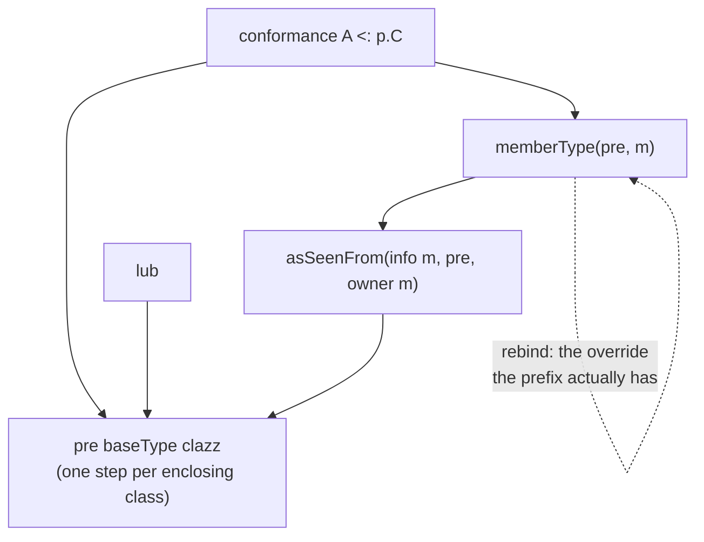
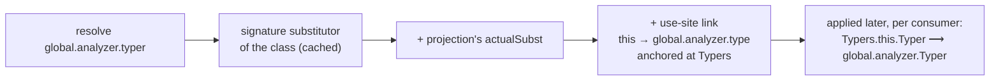
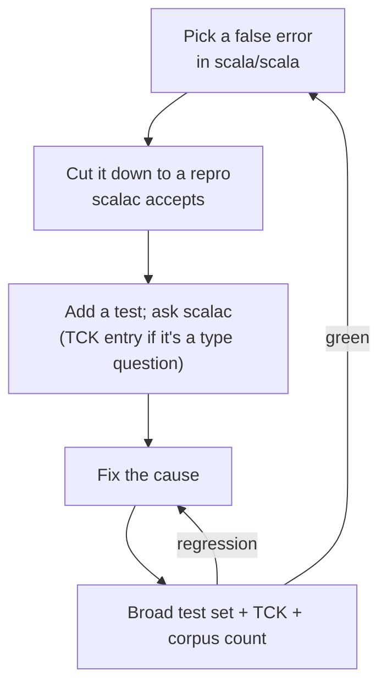
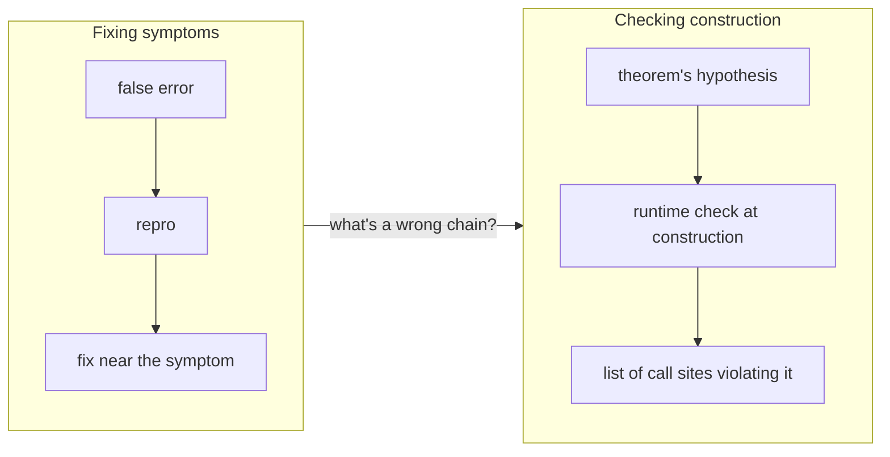
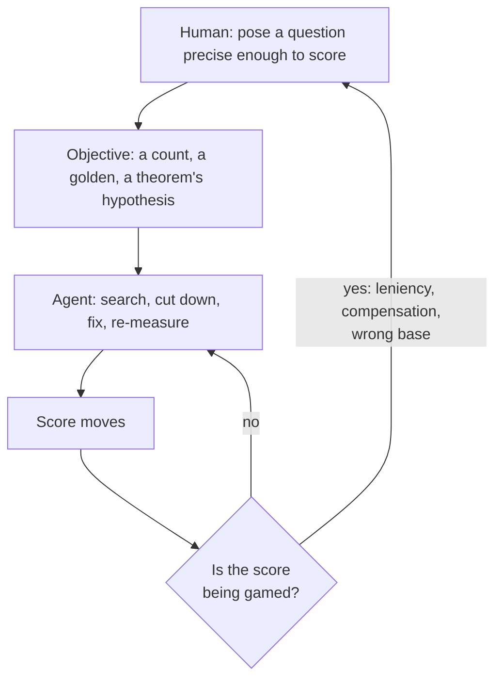

# Teaching IntelliJ the cake: a scalac oracle, a Lean model, and an agent that hill-climbs

**Audience:** maintainers of scalac / dotc, the IntelliJ Scala plugin, Metals and presentation compilers, and anyone building a second implementation of a type system. They know `asSeenFrom` exists; most haven't had to reimplement it.

**Thesis:** a type checker that disagrees with its reference compiler should be fixed at the *operation* that diverges, not at the symptom. That needs three oracles of different strength: the reference compiler answering small questions, a large real codebase, and a formal model that says when a construction is right. With those in place, the human poses questions precise enough to be scored, an LLM agent hill-climbs against the score, and the human checks whether the score is being gamed.

<!-- break -->

**Arc:**

1. The symptom: 7201 false errors in scala/scala's own compiler sources, and why fixing them one report at a time never converged.
2. The theory: five scalac operations, what the SLS says about them, and how IntelliJ's design (declaration-keyed types, lazily applied substitutor chains) diverges.
3. The oracles: a differential TCK against `nsc.Global`, the real corpus, a commit-by-commit scan.
4. Hill-climbing on symptoms: what it fixed, and how it misled.
5. From symptoms to construction: a Lean model of `asSeenFrom` vs the chain, turned into runtime checks that name the line that built a bad chain.
6. Performance: a cost model first, then measurement.
7. The method: posing the right questions and letting an agent climb.
8. Results and asks.

**Suggested budget (~50 min):** I 5 · II 10 · III 5 · IV 7 · V 10 · VI 5 · VII 6 · close 2. Part VI can be a single slide.

---

## Part I — The symptom

### 1. The cake pattern

scala/scala's compiler is the canonical cake: traits that refer to each other through self types and abstract `val global: Global` members.

```scala
trait Typers { self: Analyzer =>
  import global._                  // global: Global, abstract in Analyzer
  def typer: Typer = ???
  class Typer(context0: Context) { /* 6,000 lines */ }
}
abstract class Global extends SymbolTable {
  object analyzer extends { val global: Global.this.type = Global.this } with Analyzer
}
```

- `global.Tree`, `Typers.this.global.Tree`, `analyzer.global.Tree` and `Global.this.Tree` all name **the same type**, but only because of a singleton-typed override (`val global: Global.this.type`) several hops away.
- Every member access re-derives that equality: the declared type of a member is written from inside its class (`Typers.this.Typer`) and must be *rewritten onto the path* it was selected through.
- Any "module as a value" design in Scala 2 has the same shape.

### 2. False errors in `Typers.scala`

Open `src/compiler/scala/tools/nsc/typechecker/Typers.scala` on `idea263.x`: **569 errors**, none of them real. A selection:

```text
Type mismatch, expected: Analyzer.this.Context, actual: Typers.this.Context
Illegal inheritance, self-type Typer does not conform to Typer
Method 'isCoercible' overrides nothing
Type mismatch, expected: scala.tools.nsc.Global.erasure.global.erasure.global.Symbol,
               actual: Typers.this.global.Symbol
Cannot resolve method MethodType.unapply
```

- The first three are the same bug: two spellings of one `this` treated as two instances.
- The fourth is the other bug: a path that *grew* while being rewritten, `global.erasure.global.erasure.global`. Left alone, it grows until the stack overflows (SCL-18532, originally 600% CPU in `recursiveUpdate`).
- Across all of `src/reflect` + `src/compiler` (492 files): **7201 errors in 183 files**.

### 3. Why one-at-a-time fixes didn't converge

- Individual reports had been fixed one at a time for years. Each fix was local, and new reports kept arriving.
- The cause is structural. scalac computes these types with a handful of core operations. IntelliJ approximates the same operations in *several* places (substitutors, projection types, conformance, resolution, bounds) that disagree with scalac and with each other.
- A symptom surfaces far from its cause: a substitutor built wrong during resolution does no harm where it is built, and shows up later as a conformance error on an unrelated expression.
- **The useful question is which core operation diverges from scalac, and where IntelliJ computes it.**

#### 3a. The first attempt (2023–2024)

- **2023:** Jason's fix for SCL-21585 (a type-member refinement lost through an HList-style projection), merged upstream by Andrei Sugak.
- **2024:** Dale Wijnand and Jason, [JetBrains/intellij-scala#663](https://github.com/JetBrains/intellij-scala/pull/663). It identified the core of the problem:
  - pass the anchor, the class whose member's type is being substituted (scalac's `seenFromClass`), into `ThisTypeSubstitution`, and use it to guide the walk through enclosing classes;
  - fix `BaseTypes` for `ScThisType`.
- Lukas Rytz confirmed it fixed SCL-21947 on scala/scala, and it was merged into 251.x.
- It was not comprehensive or rigorous enough to avoid collateral damage:
  - the anchor was optional, and passed at a few call sites; elsewhere the walk fell back to guessing by inheritance (this work's census later counted 7245 unanchored links, §22);
  - the other operations (`memberType`, merged base types, lub) were left as they were;
  - it was checked against the existing tests and the reports at hand, and JetBrains CI found four more failures (scalac test data, Meerkat, dependent pattern types, a recursive alias), fixed in a second round.
- **This work starts from the same diagnosis and adds what was missing: an oracle for each operation, a corpus large enough to show collateral damage, and a model that says when the anchoring is complete.**

---

## Part II — The theory: five operations

### 4. Five operations

Almost every false error here is IntelliJ approximating one of five scalac operations too coarsely:

| scalac | What it does | IntelliJ counterpart |
|---|---|---|
| `memberType` | the type of a member viewed from a prefix, using the most specific override | `ScProjectionType.actual` |
| `asSeenFrom` | rewrites `C.this` in a member's type onto the path it was selected from | `ThisTypeSubstitution` in `ScSubstitutor` |
| `baseType` / `baseTypeSeq` | the instance of class `C` among `T`'s base types, merged when `C` is reached through several parents | `BaseTypes` |
| `lub` | least upper bound over base type sequences, as seen from the prefix | `BoundsUtil` |
| `packedType` | widens block-local types out of a block's result type | `ScBlock` |



**The others depend on `memberType`.** `asSeenFrom` needs it to find the prefix to rewrite onto; conformance needs it to follow a singleton path to its underlying type.

### 5. `asSeenFrom`: one anchored walk

scalac's `thisTypeAsSeen` (`TypeMaps.scala`) is a loop over two cursors in lockstep:

```text
loop(pre, clazz):
  if clazz is a package                              → leave D.this alone
  else if clazz == D && pre baseType clazz exists    → pre        (matchesPrefixAndClass)
  else loop((pre baseType clazz).prefix, clazz.owner)
```

- The walk starts at the **anchor**: the class the type was written in, `sym.owner` for a member's type. It climbs one enclosing class per step while `pre` steps to the matching enclosing instance.
- `D.this` is rewritten only when the cursor *is* `D`, not when it is a subclass of `D`.
- It terminates because it only climbs a finite owner chain and only strips prefixes. **Its output is never fed back into it.**

As a recurrence, with $\mathrm{bpre}(p, c) = (p \;\mathtt{baseType}\; c).\mathtt{prefix}$:

$$\mathrm{tas}_d([\,], p) = d.\mathtt{this} \qquad \mathrm{tas}_d(c :: cs, p) = \begin{cases} p & c = d \wedge \mathrm{hasBase}(p, c) \\ \mathrm{tas}_d(cs, \mathrm{bpre}(p, c)) & \text{otherwise} \end{cases}$$

<!-- break -->

**What the SLS says, and where scalac differs** (from the TCK's [SPEC-GAPS.md](https://github.com/retronym/scala-type-system-tck/blob/main/docs/SPEC-GAPS.md); every example compiled with 2.13.18):

- **Subclass vs same class.** SLS §3.4 rewrites `D.this` when `D` is a *subclass* of the class at the current step. That is scalac 2.10's `toPrefix`; 2.11 rewrote `asSeenFrom` with the stricter `clazz == candidate`. For types scalac builds itself the two appear to agree. They diverge for an implementation that *spells* types differently, which IntelliJ does (§6).
- **Class type parameters: the literal SLS reading is unsound.**

```scala
class D[A](val a: A) { class C extends D[Int](1) { def f: A = D.this.a } }
val d = new D[String]("s")
val r = (new d.C).f      // scalac 2.13 and Scala 3: String. Literal SLS: Int. Runtime: "s".
```

- **Unstable prefixes.** §3.4 answers `S` even when `S` isn't a path; scalac captures it as `_1.type forSome { val _1: S }`, which is what §6.4's "typed as if `{ val y = e; y.x }`" implies.
- The SLS is declarative and mostly enough. Where it is ambiguous, a second implementation has to follow scalac, so scalac is the oracle.

### 6. IntelliJ's version: the substitutor chain

IntelliJ does the same job with an `ScSubstitutor`, built up during resolution rather than computed as one map:

- a **chain** of **links** applied left to right (`a.followed(b)` applies `a` first);
- a link is a type-argument binding (`T -> Int`) or a this-type rewrite: "replace `C.this` by this prefix, walking from anchor `D`";
- a chain is attached to every resolve result, extended as resolution descends through prefixes and parents, and applied lazily, each time a consumer asks for a type;
- links are *fused*: one traversal, each leaf passed through every link; a replacement that is not a leaf is traversed by the remaining links.



- Two differences from scalac matter. **Results recirculate:** a rewritten type flows back into resolution, which mints new chains from it, and `baseType` is a live recomputation that re-enters the walk. **Spelling:** IntelliJ names a self-type member after its *declaring* trait (`SymbolTable.this.Type` inside `trait Definitions { self: SymbolTable => }`), scalac after the trait the reference is in (`Definitions.this.Type`).
- **The false errors came from chains built wrong and then applied, not from the rewrite itself: a link with the wrong anchor, a link where there should be none, a chain stored where it is later applied to unrelated types.**

### 7. `memberType` and `rebind`

```scala
trait A { val x: AnyRef; def get: x.type = x }
trait B extends A { val x: String }
def f(b: B) = b.get.length          // scalac: Int
```

- `b.get` has type `b.x.type`. Its underlying type is `String` only if `x` is **rebound** to `B#x`, the override the prefix has. scalac does this in `rebind`.
- IntelliJ's designators pointed at the declaration, `A#x`. So `analyzer.global` was an arbitrary `Global`, not `Global.this`.
- **Fix:** one override-aware `memberType` (`ScProjectionType.actual`), replacing three hand-written copies.

### 8. Merged base types

When a class is reached through several parents, scalac merges the type arguments position by position by variance:

$$\mathrm{baseType}(\mathit{Box}[\mathit{Dog}] \;\mathtt{with}\; \mathit{Box}[\mathit{Cat}],\ \mathit{Box}) = \mathit{Box}[\mathit{Dog} \;\mathtt{with}\; \mathit{Cat}] \quad (\text{covariant } \mathit{Box})$$

- The SLS rule is stricter: one instance must conform to all the others, or it's an error. scalac enforces that for class definitions but accepts compound types and merges them. **The variance merge is unspecified; only scalac defines it.**
- IntelliJ took the first arm it found, and the base types of `X.this` missed `X`'s self type.

### 9. lub keeps the prefix

Cut down from `Typers.scala` (`CakeLubTest`):

```scala
trait Symbols { self: SymbolTable =>
  abstract class Symbol
  abstract class TypeSymbol extends Symbol
  abstract class AliasTypeSymbol extends TypeSymbol
  abstract class AbstractTypeSymbol extends TypeSymbol
}
trait Typers { self: Analyzer =>
  import global._
  def f(a: AliasTypeSymbol, b: AbstractTypeSymbol, c: Boolean): Symbol =
    if (c) a else b   // scalac: global.TypeSymbol
                      // IntelliJ was: Symbols.this.TypeSymbol, which doesn't conform to Symbol
}
```

- `BoundsUtil` normalized `global.AliasTypeSymbol` to its declaration-site type before walking base classes, so the lub lost the `global.` prefix.
- scalac computes the lub over the base type sequences of `global.AliasTypeSymbol` and `global.AbstractTypeSymbol`, which are seen from `global`.
- **This one bug caused most of the false errors left in `Typers.scala`.** It affects every `if`/`match` with cake-typed branches.

### 10. Block type avoidance: escaping local singletons

A block's type must not mention its local definitions (scalac's `packedType`, SLS §6.11).

```scala
trait Tree { def thisTree: this.type = this }
def foo = { val X: Tree = mkTree(); X.thisTree }   // scalac: foo: Tree
```

- The block's result type is `X.type`, but `X` is local to the block, so `foo`'s inferred type must widen it to `Tree`.
- IntelliJ let `X.type` escape, then reported "Required Tree, found X.type" at every use of `foo`.
- `ScBlock` now widens a block-local singleton to its declared type, repeatedly, since the widened type may mention another one.

### 11. Block type avoidance: local classes and invariant positions

Widening is right only in a covariant position, and a local class has no singleton to widen.

```scala
{ class C extends Base; new C }               // scalac: Base. IntelliJ was: C
{ val X: Tree = t; new Ref[X.type](X) }       // scalac: Ref[_1] forSome { type _1 <: Tree with Singleton }
                                              // IntelliJ was: Ref[Tree]
{ class C extends Base; new Ref(new C) }      // scalac: Ref[_1] forSome { type _1 <: Base }
```

- Each local occurrence is abstracted existentially, then simplified as SLS §3.2.12 does: covariantly to its upper bound (a val's declared type, a class's parents), contravariantly to `Nothing`, invariantly to a quantified `_k`.
- Still open: a local class with a member returning `this.type` packs to its plain parents, where scalac keeps a refinement (`Object { def me: this.type }`, TCK 33).

---

## Part III — The oracles

### 12. A differential TCK against `nsc.Global`

[retronym/scala-type-system-tck](https://github.com/retronym/scala-type-system-tck): a corpus of small programs, each paired with type-system questions.

```text
corpus/NN-name/
  source.scala      declarations, with /*ANCHOR id*/ markers
  tck.json          queries: conformance, equivalence, baseTypeSeq, baseTypes, termTypes
  expected.json     goldens, generated by scalac, never edited
```

- **Two engines, one contract.** `ScalacEngine` splices each query into the preamble as `type __q_x = …` or `val __t_x = …`, compiles to the end of typer, and reads the answers off the typed trees. `TypeSystemTckTest` in the plugin answers the same queries through PSI.
- **Anchors** make context-dependent types nameable: `AnimalBox.this.type` exists only inside `AnimalBox`. A query with an anchor is resolved *as if written at the marker*. SCL-21947 is in this area: `AnimalBox <: Animal` is false, `AnimalBox.this.type <: Animal` is true.
- **Rendering normal form**, so two engines' types compare as strings.
- **Strict both ways.** Known differences are in a deferral registry; a new difference fails, and so does a deferred one that starts passing.
- **Negative entries** matter as much as positive ones: corpus 28 pins that `o.Tree` is *not* `Global.this.Tree` for an arbitrary `o: Global`. (§17).

### 13. The real corpus

- `src/reflect` + `src/compiler` of scala/scala (b4ad4458da) mounted as a source root in a light test fixture; `doHighlighting()` per file, with a real JDK 17 and scala-asm on the classpath.
- One harness for both questions: *how many errors?* (and which are new vs base) and *how long?*
- **The two oracles fail differently.** The TCK is precise, small and scalac-backed, but only as good as its questions. The corpus is large and real, but a count of errors cannot tell a correct fix from a lenient one (§17). Each catches what the other misses.

### 14. A commit-by-commit scan

- Every commit of the branch, measured against the *final* TCK and against its own tests, cached by tree hash.
- Failing TCK rows fall from 33 to 16 and never rise; all conformance and equivalence rows pass at the tip. The 16 left are representation differences in base-type lists and planned fixes.
- Tests green at every commit except two, both before the commit that replaced the old recursion guard.
- **The scan checks the history commit by commit**, which made it safe to squash 61 commits into 30 and then fold away the shortcuts entirely (§17).

---

## Part IV — Hill-climbing on symptoms

### 15. The loop



- An agent is very good at this loop: the score is mechanical, the repros are small, the space is large and regular.
- The **broad** test set matters: `typeConformance.*`, `typeInference.*`, `annotator.*`, `codeInsight.intention.types.*`, `lang.resolve.*`, `typeSystemTck.*`, about 30 min. A narrower 597-test "oracle" from an earlier handoff missed **six real regressions**.
- What this phase delivered: the override-aware `memberType` (§7), merged base types, block type avoidance, the lub prefix, five independent upstream bugs (exports anchoring, a class type conforming to its own `this.type`, `Null` eligible for implicit conversion, the lub prefix, an SCL-22266 cache-poisoning recursion), and owner-chain matching.

### 16. Termination: making the rewrite stop growing

`Infer.this.global.Type → Infer.this.global.analyzer.global.Type → … → StackOverflowError`.

- The existing brake, `hasRecursiveThisType` (SCL-18532), refused a rewrite if the target mentioned a this-type of the rewritten class. It blocked legitimate rewrites (false errors) and missed one growth pattern.
- **Key observation:** each individual rewrite is one scalac also performs. `Infer.this` asSeenFrom the analyzer path *is* the analyzer path, in scalac too. The divergence is the *recirculation*, not the rewrite. scalac needs no guard because round trips are neutral: $\mathrm{underlying}(\mathit{pre}.\mathtt{analyzer}.\mathtt{global}) = \mathit{pre}$.

**Ruled out, each by a test:**

| idea | why not |
|---|---|
| depth limit | growth is sequential, not nested: fires at depth ~2, reaches 60+ segments |
| canonicalize at mint (`a.global.analyzer.global` ↦ `a.global`) | kills the spelling doubling, not the growth (kept anyway) |
| anchoring alone | fixes which walk runs, not its output |
| terminal output (a rewrite's result skips the rest of the chain) | stops growth, breaks SCL-7043 (`Enumeration.this → CE.this.enum.type`, then `CE.this` must be re-anchored) |

<!-- break -->

**Candidate rules, modelled as `TypeMap`s inside scalac's own test suite** with scalac's `asSeenFrom` as the oracle:

| rule | exact growth | cross-symbol growth | SCL-7043 |
|---|---|---|---|
| target contains the rewritten this-type (old guard) | blocked | **missed** | admitted |
| rewritten this is the root of the target's spine | blocked | **missed** | admitted |
| **no self-embedding**: the *result* is rooted in the rewritten this-type or an inheritor | blocked | blocked | admitted |

- Then the cross-symbol growth reappeared on a skeleton of the real `Infer`/`Analyzer`/`Global` cake (TCK 26): the walk's fallback rewrote `Infer.this` under a link anchored at `Typer`, whose owner chain never reaches `Infer`. **Owner-chain matching** gates the fallback the way `matchesPrefixAndClass` demands `clazz == candidate`.
- The next phase showed the no-self-embedding rule itself was unnecessary and deleted it (§22). It is still the right rule *for a system that might mis-anchor*.

### 17. Lenient equivalences

Two equivalences look plausible for override matching in the cake:

$$\mathtt{Types.this} =:= \mathtt{SymbolTable.this} \quad \text{(self types tie them)} \qquad \mathtt{Global.this} =:= p \quad \text{(any stable } p : \mathit{Global}\text{)}$$

- Both make false errors disappear. Both are **unsound**, and scalac rejects both.
- An error count rewards them: every leniency removes errors and adds none. **An agent optimising for fewer false errors will find these.**
- The branch had them for a while (`sameThisInstance`). They came out when TCK 28 added the negatives (`o.Tree` is not `Global.this.Tree`; `Api.this.T` is not `Universe.this.T`) with a positive control (`val same: Global.this.type`), and §7 plus merged base types covered the override cases that had seemed to need them. The history was then folded so they were never added.
- **Rule: every objective that counts false positives needs a paired oracle for false negatives.**

### 18. Compensating bugs

- A member found through a self type was anchored at the wrong class. A separate "self-type allowance" in the rewrite compensated for it. Together they gave the right answers on the corpus.
- Each fix chasing a symptom is biased toward compensation: it is checked against the error it removes, and a compensating change removes it just as well.
- It surfaced as 60 errors in `Importers.scala` (`Importers.this` rewritten to `from`). Fixing either half alone moved errors to other files (`Typers.scala`, `JavaMirrors.scala`); only replacing both with anchoring at the self type's class cleared them.
- **This phase could show the plugin gets the right answers on this code. It could not show it gets them for the right reasons, and it could not say when it had found every cause.** So it kept escape hatches: the no-self-embedding guard, and `TypeRecursionGuard`'s depth bound.

---

## Part V — From symptoms to construction

### 19. Catching bad chains where they are built

> If the mistakes are in how chains are *built*, catch them where they are built.

- Ideal: a wrongly built chain is unrepresentable. Next best: it fails fast when minted, naming the line that minted it.
- That replaces debugging each new symptom with one sweep over the limited number of ways a chain can be built wrong.
- **This needs a precise definition of "wrongly built", which the formal model provides.**



### 20. The Lean model

[`lean/` in the TCK repo](https://github.com/retronym/scala-type-system-tck/tree/main/lean), Lean 4, no Mathlib, ~840 lines, no `sorry`.

```lean
abbrev Class := List Nat            -- owner path, innermost first: the climb is List.tail

inductive Ty where
  | this : Class → Ty              -- D.this
  | sel  : Ty → Nat → Ty           -- q.v and q#n
  | pair : Ty → Ty → Ty            -- any other structure
  | tvar : Nat → Ty                -- what a type-argument binding rewrites

structure World where
  bpre    : Ty → Class → Ty        -- (p baseType c).prefix
  hasBase : Ty → Class → Bool      -- p.baseTypeIndex(c) != -1
```

- Classes as owner paths turn scalac's climb into **structural recursion**, so Lean checks termination.
- A `World` supplies the *only two facts* the walk reads off the environment. Every theorem holds for any class table that supplies them.
- `Scalac.asf` is `asSeenFrom`; `IntelliJ.thisAsSeen` is the plugin's walk *with* its narrow-against-target fallback.

<!-- break -->

**One assumption, lockstep:** an `asSeenFrom` map commutes with taking a base type's prefix.

$$\mathrm{bpre}(\mathrm{asf}_{p_2,c_2}(p),\ c) = \mathrm{asf}_{p_2,c_2}(\mathrm{bpre}(p, c)) \qquad \mathrm{hasBase}(\mathrm{asf}_{p_2,c_2}(p),\ c) = \mathrm{hasBase}(p, c)$$

scalac relies on it implicitly (the base types of a mapped type are the mapped base types). For the plugin it is the contract `BaseTypes.baseType` must meet, and the TCK's baseType dimension checks it empirically. **The model assumes lockstep, which the TCK checks, and proves the rest.**

### 21. What is proved

- **`compose`**: two links in sequence are one link from the first prefix seen by the second, provided the first link rewrites every this-type of its input:

$$\mathrm{inView}(p_1, c_1, t) \implies \mathrm{asf}_{p_2,c_2}(\mathrm{asf}_{p_1,c_1}(t)) = \mathrm{asf}_{\,\mathrm{asf}_{p_2,c_2}(p_1),\ c_1}(t)$$

- **`chain_is_single`**: by induction, a whole chain is one `asSeenFrom`. **So one pass suffices, and no output needs rewriting again.** A mis-anchored chain is still one `asSeenFrom`, from the wrong prefix.
- **`stateSafe_preserves_this`**: a chain with no this-type rewrites keeps every this-type of its input, so it can be stored in resolver state and applied to other references' types.
- **`IntelliJ.agrees`**: wherever the fallback doesn't fire, the plugin's walk *is* scalac's. So a disagreement can only come from the fallback, a wrong anchor, or a wrong prefix, never from the walk itself.

Three conditions follow, and a chain that meets them is right by construction:

1. each this-type rewrite is anchored at the class the type was written in (`sym.owner`);
2. a chain stored in resolver state holds only type-argument bindings;
3. given 1 and 2, one pass is enough.

**The conditions say when the set of root causes is complete, which fixing symptoms could not.** It covers this-type rewriting only; base types, lub and block avoidance still rest on the TCK.

### 22. Theorems as runtime checks

`SubstitutorInvariants`: each rule states a theorem's hypothesis, checked where chains are built and applied. Off in production. In tests it counts violations, keeps samples, and records the call path into each, so **a count names the line that built the chain**. Any rule can fail fast: `-Dscala.types.substitutorInvariants.<rule>=off|record|fail`.

| rule | condition | outcome |
|---|---|---|
| A2 | a stored chain has no this-type rewrites | 458 violations, all one site; fixed; fails the tests |
| A6 | every rewrite has an anchor | 7245 violations; now true by construction |
| I4 | one pass is enough | the guard enforcing it fired 22,529 times, every sample a rewrite scalac performs; guard deleted |
| A5 | a this-type the chain leaves alone, scalac leaves alone too | 7 cases in the corpus, none causing an error |
| A1 | a link maps its target to itself, or is self-rooted and occurs once | silent over tests and corpus; fails the tests |
| A3, A4 | consecutive links anchored consistently | measurement only: the plugin builds `use >> sig_C`, the model `sig_C >> use` |

<!-- break -->

**What the checks found:**

- **A2, a latent leak.** To type `case FlatMap(f, k) =>` inside `class IO`, `PatternTypeInference` built the pattern's bindings *plus* a rewrite `FlatMap.this → IO.this.type` for the `unapply`. The resolver stored the whole chain for the case body and applied it to every reference in it:
  `` ScSubstitutor(`this` -> IO.this.type asSeenFrom FlatMap >> Map(A -> Any, B -> A)) ``.
  No corpus error was traced to it. The case body now receives only the bindings.
- **A6, the anchorless walk.** 7199 of 7245 were members with no PSI class: synthetics like `==` (in scalac, members of `Any`, whose types mention no this-type) and refinement members (where a second rewrite made `clone.NameType` an alias of itself). A missing class now means "no rewrite"; three callers were anchored properly; the anchorless mode is deleted.
- **I4, a redundant guard.** With every link anchored the model says no guard is needed; the census said the guard was only ever refusing correct rewrites. Deleted: same corpus errors, nothing grows, `Typers.scala` no slower.

### 23. A1: links that rewrite their own target

**A1 is checked lazily**, at a link's first use, unlike the other rules. Checking it when the link is built evaluates types earlier than the plugin otherwise would, and that was shown to change typing results (a conformance in `JavaClearable.scala` flipped).

| | rule | |
|---|---|---|
| version 1 | the link maps its own target to itself (`idempotent_of_fixed`) | simple, but rejects some correct links |
| version 2 | as version 1, or the target is rooted in the class being rewritten and the link occurs at most once in its chain (`once_is_scalac`, `selfRooted_twice_diverges`) | no false positives over the tests and the corpus; still proved in the model |

```scala
class UnitScanner { lazy val parensAnalyzer = new ParensAnalyzer(...) }
class ParensAnalyzer extends UnitScanner
// inside UnitScanner, parensAnalyzer.balance(token) uses the link
//   UnitScanner.this -> UnitScanner.this.parensAnalyzer.type
```

Applied once, this link gives scalac's result. Applied twice, it gives `UnitScanner.this.parensAnalyzer.parensAnalyzer.T`.

### 24. The remaining errors

Next, each remaining corpus error was cut down and, where the language rule was in doubt, compiled with scalac 2.13. Four long-standing bugs, all also on `idea263.x`:

- an untyped override of an `if`/`match` is typed against the overridden result type, not the lub of its branches; lub keeps a type-member refinement that both operands define alike, except where scalac drops it (an alias to a type parameter, an abstract type or a singleton);
- a method with a missing argument list eta-expands to an expected SAM type;
- a `var` may override a concrete getter/setter pair;
- a `val` typed by an alias to a singleton type is equivalent to that singleton: `TastyUniverse.symbolTable.type =:= symbolTable.type`, with each path keeping its own spelling, as in scalac.

As with the earlier changes, the TCK kept these fixes to what scalac does: entries 38–40 pin the lub refinement and the alias-to-singleton cases with scalac's answers.

---

## Part VI — Performance: reason first, then measure

### 25. A cost model before any tuning

[asf-chain-toy/WRITEUP.md](https://github.com/retronym/asf-chain-toy/blob/main/WRITEUP.md): derive the cost of both designs from the code, then check it three ways.

$$T_{\mathit{scalac}}(\mathrm{asf}) = O\big(n + t \cdot d \cdot (L + R)\big) \qquad W_{\mathit{IJ}} = O\big(d \cdot (N + B_i) + p \cdot N\big)$$

- $n$ nodes, $t$ this-leaves, $d$ owner steps, $L$ linearization size, $R$ one relativized base-type element; for IntelliJ $B_i$ is one `BaseTypes.baseType` and $N$ one `isMoreNarrow`.
- scalac: every per-use step is an index scan over a cached array. IntelliJ: `baseType` was **uncached and exhaustive**, $O(E \cdot s)$ over the whole base-type DAG, even after finding the class.
- And canonicalizing a path re-canonicalized its prefix through an uncached call, with fresh fuel:

$$C(p) = 2\,C(p-1) + A(\text{val type}) \quad\Rightarrow\quad \text{exponential in path depth, capped at } 2^8$$

### 26. Checking the model

Three independent checks:

- **toy re-implementations** of both algorithms with counters, which agree on every type;
- **a generated sweep** over path depth: nested cakes `D1`…`D8`, each with 20 references `Top.v1…vd.x.m`;
- **counters and async-profiler** while highlighting `Typers.scala`, and A/B timing that alternates variants rep by rep inside one JVM.

| quantity on one `Typers.scala` highlight | value |
|---|---|
| substitutor applications | 2.33M, mean chain length 1.84 |
| this-walks / distinct keys | 1.85M / 4,067: **99.8% repeats** |
| `BaseTypes.baseType` calls / distinct keys | 232k / 2,080: **99.1% repeats** |
| substitution share of plugin CPU | 9–10% |

**Every term of the model is small ($k \approx 2$, $d \approx 1$, $p \approx 1$). The cost is repetition.** Fusion and chain length don't matter.

### 27. Remedies and results

- `baseType` cached the way `Conformance` caches: project-level map on `(ScType, PsiClass)`, `ContextDependent` values, a `RecursionGuard` with `mayCacheNow`, re-entrant query answers "no base type".
- `canonicalizeTarget` cached on `ModTracker.anyScalaPsiChange`; paths it can't change skip the cache.
- A `TypeRecursionGuard` trip prohibits caching, so nothing caches a fallback.

| | before | after |
|---|---|---|
| nested cake, depth 6 / 7 / 8 | 239 / 553 / 1,427 ms | 125 / 135 / 149 ms |
| substitution share of plugin CPU on `Typers.scala` | 9.0% | 3.8% |
| `Typers.scala` cold / warm min, vs `idea263.x` | 22.7 / 14.7 s | 20.0 / 13.0 s |

The exponential is gone. The everyday cost is a few percent of highlighting; ~70% of plugin CPU on `Typers.scala` is conformance, `TypeDefinitionMembers`, `BaseProcessor` and `MixinNodes`, outside this work. **Future work:** compute a member's type from a prefix in one cached function, `memberType(pre, m)`, as scalac does, instead of assembling substitutor chains during resolution. A mis-anchored chain could then not be built at all, and the repeated walks would go.

### 28. Benchmarking

- Alternate base and tip within a session, and prefer counters and profiles to wall-clock.
- **Know what's switched on.** A retime made the tip look 30% slower than base: the invariant checks default to `fail`/`record` in unit-test mode, and the harness is a test. With the checks off, the tip is ~10% faster cold.
- **Know what the base is.** An early "1233 errors on base" turned out to be `idea263.x` *plus* upstream fixes; plain base is 569.
- Not like for like either way: once an expression has a false error, the base does less work on what depends on it.

---

## Part VII — The method: posing questions, letting an agent climb

### 29. Division of labour



- **Early on, I wrote much of the code myself, with agent assistance.** That got the anchoring, `memberType` and base-type changes in place, and then hit a ceiling: each fix moved errors elsewhere, and there was no way to tell when the work was done.
- **The shift was to posing questions instead.** From then on the agent did most of the climbing: repros, fixes, Lean proofs, harnesses, census runs, bisects, history surgery, write-ups. My contribution was mostly **questions**, each one turning a vague goal into something an agent can climb, and **vetoes**, each one closing a direction where the score was rising for the wrong reason.
- That is what got the work to a finished state.

### 30. The questions that moved the work

| question | what it turned into |
|---|---|
| What does scalac say? | the differential TCK; goldens instead of opinions |
| What does scalac's trace of this operation look like? | instrumented scalac tracing the operation on the repro (`asSeenFrom`, `lub`), compared step by step with the plugin's |
| Does it hold on the real thing? | the corpus harness; "probe the real cake, don't guess synthetic ones" |
| Which *operation* diverges? | the five-operation map; fixes at the operation, copies deleted |
| Is it right for the right reasons? | the model and the construction checks (Part V) |
| What exactly is a wrongly built chain? | the Lean model and its three conditions |
| Can we catch it where it's minted? | `SubstitutorInvariants`, a count per call site |
| When the guard fires, is it ever right? | the I4 census; the guard deleted |
| Does the check change what it measures? | lazy A1; the `JavaClearable` flip |
| Would scalac reject this shortcut? | TCK 28 negatives; leniency removed |
| What does a cost model predict, before tuning? | the asf-chain-toy write-up; two caches, not a rewrite |
| Is every commit green and better? | the commit scan; a history worth reviewing |

**A useful question has a mechanical answer.** "Make the errors go away" does not; "make `asf_chain = asf_scalac` on every link the corpus mints" does.

### 31. How the score gets gamed

Every one of these happened. Each was caught by a second oracle or a human question, not by the score itself.

- **Leniency** (§17): fewer false errors by accepting unsound equivalences.
- **Compensation** (§18): two wrongs cancel on the corpus.
- **Narrow oracle**: a 597-test subset passed while six real regressions slipped through.
- **Wrong baseline**: "1233 errors on base" was not plain base.
- **A check that changed typing** (§23) and **an instrumented benchmark** (§28).

**This is Goodhart's law: the agent optimises the measure it is given. The defence is to pair every measure with an independent oracle of a different kind.**

### 32. Why this domain suits it, and what it needs

**Suits it:**

- a mechanical reference (scalac answers any type question in milliseconds);
- tiny reproducers, and a large real corpus;
- a large but regular search space (operation × type shape × path shape);
- a formal model small enough to prove things in, so "is this rule right?" becomes a `lake build`.

**Needs:**

- isolation: one git worktree and one IntelliJ test sandbox per agent;
- durable memory outside the context window: PR comments for design notes and investigation records, tags for every pre-rewrite history, notes the next session reads first;
- a human who interrupts it as soon as it heads the wrong way, and who asks for its opinion on a proposal rather than its agreement.

<!-- break -->

**What it didn't do:** choose the oracle, choose the model's abstraction (classes as owner paths, two world facts, lockstep as the one assumption), or decide that a check which fires 22,529 times on correct code means the guard should go rather than the check. Those were design judgements. **The agent found counterexamples; the human decided what counts as one.**

---

## Close

### 33. Results

| | `idea263.x` | this branch |
|---|---|---|
| errors in scala/scala compiler + reflect (492 files) | 7201 in 183 files | 35 in 18 files |
| false errors in `Typers.scala` | 569 | 0 |
| nested cake, path depth 8 | 1,427 ms | 149 ms |
| failing TCK rows | 33 | 16 |

- All 35 remaining errors are also on `idea263.x`; none involves a cake path or a this-type. They are general inference gaps (overload resolution doesn't check inferred type arguments against bounds; `s @ Some(_)` narrows `T := A` instead of solving `A := T`) and non-type issues.
- No `TypeRecursionGuard` trips anywhere in the corpus.
- [retronym/intellij-scala#5](https://github.com/retronym/intellij-scala/pull/5), ready to go upstream as one PR, with offers to split off the precursors.

### 34. Asks

- **IntelliJ:** review #5 as a whole; adopt the TCK in CI.
- **scalac / SLS:** the two spec clarifications (class type parameters in `asSeenFrom`; stable prefixes), and the variance merge of compound base types written down.
- **Metals, presentation compilers, TASTy readers of Scala 2 signatures:** the TCK has no IntelliJ dependency. Write a second engine.
- **Scala 3:** the corpus is 2.13 only. `&`/`|`, opaque types and match types need a dotc oracle, and the same three-oracle method would apply.

### 35. Questions to leave the room with

- Which other subsystems have a reference implementation that could be an oracle (implicit search vs scalac's, the Scala 3 TASTy reader vs dotc)?
- Is "a theorem's hypothesis as a runtime check that names the call site" a pattern worth building into type checkers generally?
- How much of a 2.13 type system can a few hundred lines of Lean say something useful about, and where does lockstep stop being a reasonable assumption?
- Agents optimise whatever score they are given. What is the cheapest *pair* of oracles for your project?

## Appendix

### Demo candidates (pick 2)

- `Typers.scala` on `idea263.x` vs the branch, side by side, scrolling the gutter.
- A TCK entry end to end: `source.scala` with an anchor, `scala-cli run reference -- show 28-…`, the PSI side failing on a deliberately reintroduced leniency.
- `-Dscala.types.substitutorInvariants.A2=fail` on the pre-fix commit: the stack names `PatternTypeInference`.
- `lake build` and a walk through `once_is_scalac`.
- The nested-cake depth sweep before/after the caches.

### TODOs

- Confirm the time span of the work and the split of human questions vs agent initiative in §30 with concrete examples from the session transcripts.
- One slide of real agent transcript: a question, the agent's census, the decision.
- Re-time with more rounds; replace the §27 `Typers.scala` row.
- Decide whether §16's scalac-side `TypeMap` model (a local scala/scala branch) should be published.
