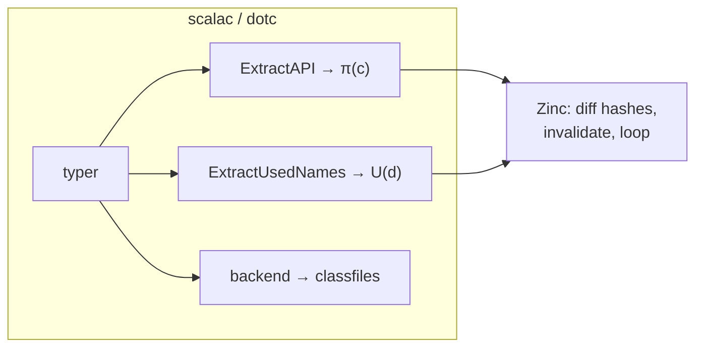
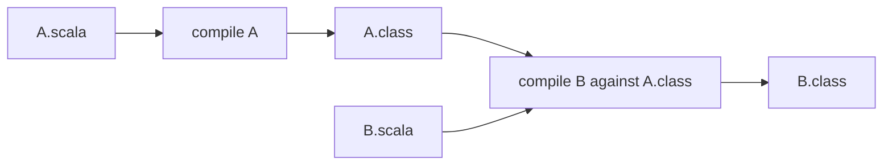
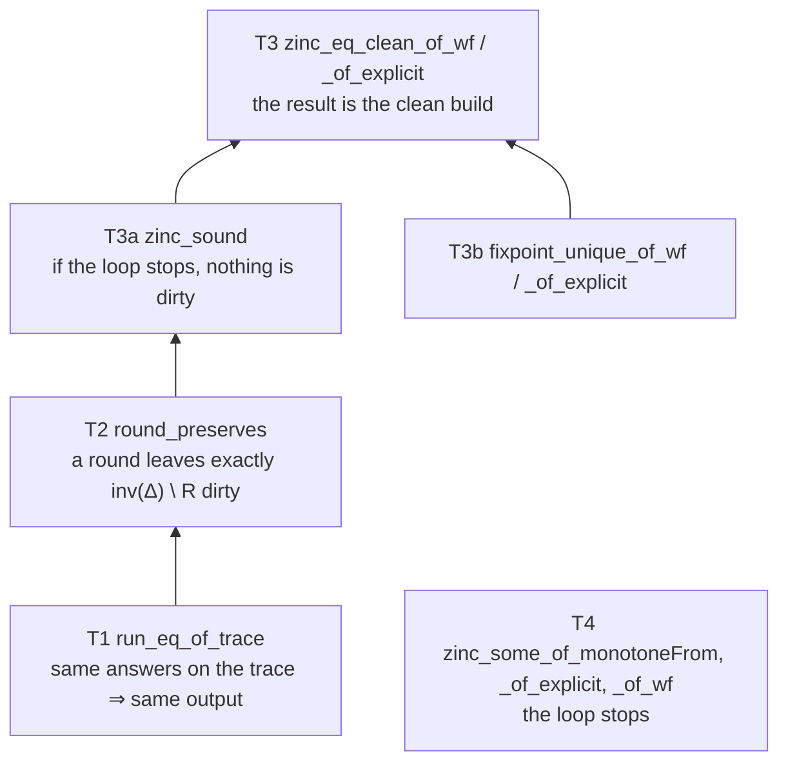
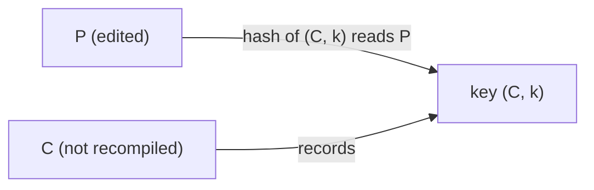
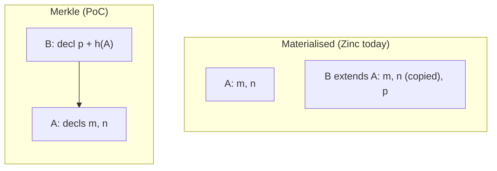
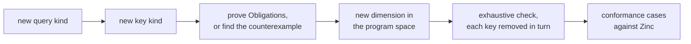
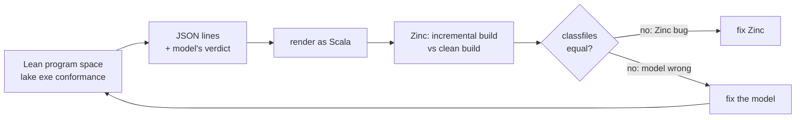

# Formalising Zinc's incremental compilation in Lean

**Status:** first draft of the slides. Each card is one slide (a few are split with `<!-- break -->`). The small grey block under a slide holds speaker notes, the evidence in the Lean model, the time budget and links to bugs; it is not meant to be shown.

**Audience:** Scala tooling people: compiler, build-tool and IDE maintainers. They know Zinc as users and some of its internals, know dependent types and maybe Curry–Howard, but not Lean.

**Thesis:** incremental compilation is sound relative to a small set of obligations on the compiler. Writing the obligations down in Lean replaced fixing Zinc bugs one report at a time with a repeatable process: model a language feature as a new kind of query, re-prove the obligations or find the counterexample, check the model exhaustively, then test real Zinc against the model's program space.

<!-- break -->

**Where the Lean lives:** the full model is `../zinc-incrementality/lean/` (Lean and Mathlib `v4.34.1`, no `sorry`). This talk's own Lean is `lean/`:

- `lean/Primer.lean`: the primer's code, no Mathlib, checked with `lean lean/Primer.lean`. Written for this draft.
- `lean/V1/`: Parts V–VI. The abstract model (`Task`, `Model`, `Soundness`, `Uniqueness`, `Termination`) copied from the full model with only the namespace changed, plus a typecheck-only toy (`Toy.lean`: lookups with misses, implicits with shadowing, no erasure) and its checked examples (`Examples.lean`).
- `lean/V2/`: Part VII. The general model (`Model.lean`, the full model's `NCompiler`); `Embed.lean`, new, which proves V1's local model is a special case (`lift_obligations`, `zinc_lift`); the toy with erasure through a value class and a mixin forwarder (`Toy.lean`, `Examples.lean`); and the stale-Δ counterexample (`Stale.lean`).

`lake build` in `lean/` builds all three, with no `sorry`. The Lake project reuses the full model's Mathlib (`v4.34.1`).

All Lean and tool output is shown as screenshots.

<!-- break -->

**Contents (~63 min):**

| part | sections | min |
|---|---|---|
| I. The problem, and Zinc | §1 incremental = clean · §2 Zinc compares hashes · §2a modules and JARs · §3 every round is a separate compilation | 5.5 |
| II. Bugs arrive one feature at a time | §4 features add observables · §5 scripted tests are a weak oracle | 3 |
| III. Why formalise | §6 sound relative to the compiler · §7 why Lean | 2.5 |
| IV. A Lean primer | §P1 types · §P2 dependent queries · §P3 proofs as programs · §P4 tactics and `decide` | 9 |
| V. A compiler as a query tree | §8 a `Task` per class · §9 a small Scala · §10 lookup walks the linearization | 6 |
| VI. Zinc on top | §11 the loop · §12 the obligations · §13 what is proved · §14 two findings · §14a finding 1 in Zinc · §15 the first counterexample | 9.5 |
| VII. The backend and separate compilation | §16 codegen queries · §17 non-local hashes · §18 Scala 2, Scala 3, Merkle · §18a the PoC · §19 subprojects | 7.5 |
| VIII. Language features extend the model | §20 erasure · §21 macros · §22 implicit scope · §23 trait fields · §23a the classpath · §23b pipelining and bodies · §23c keys from the tree · §23d not covered yet | 11.5 |
| IX. What we got out of it | §24 the obligations as a spec · §25 findings that changed Zinc · §26 exhaustive checks · §27 conformance · §28 limits | 7 |
| Close | §29 next steps | 2 |

Over budget: cut §18a, §23, §23d and §26's table first, then one of §23a–c.

---

## Part I — The problem, and Zinc

### 1. An incremental build must equal a clean build

$$\mathit{incremental}(\mathit{state}, \mathit{sources}') \;\equiv\; \mathit{clean}(\mathit{sources}')$$

- **Undercompilation:** the two differ. The build is wrong: `NoSuchMethodError`, a missing compile error, stale behaviour.
- **Overcompilation:** they agree, but more was recompiled than needed. The build is slow.
- Users respond to both the same way: they type `clean`, and stop trusting the tool.

<div class="fn">

Notes: 30 s. This audience knows it; the point is to fix the equation we will prove. In the model the right-hand side is `Compiler.clean`; the theorems that conclude it are `zinc_eq_clean_of_wf` and `zinc_eq_clean_of_explicit` (`Zinc/Uniqueness.lean`).

</div>

### 2. Zinc compares hashes; the compiler decides what is hashed



- For each class $c$ the compiler records an API summary $\pi(c)$: a hash per name. For each class $d$ it records the names $d$ used, $U(d)$.
- Zinc recompiles $R_n$, diffs the hashes, invalidates every $d$ whose $U(d)$ meets a changed name, and repeats. It stops when nothing outside $R_n$ is invalidated.
- Zinc never re-resolves anything. Whether the result is right depends on what the compiler put in $\pi$ and $U$.

<div class="fn">

Notes: 2.5 min. Recap of `zinc-incrementality` §2–4. Mention the `transitiveStep` fallback (from round 3, invalidate the transitive closure and keep the round just compiled); it comes back in §14.

</div>

### 2a. One module, many modules, JARs

| a client depends on | Zinc knows | how a change reaches the client |
|---|---|---|
| a class in the same subproject | its source, its API and name hashes, every edge in the graph | name hashes, plus rules that walk the graph: transitive inheritance invalidation, the implicit and macro fallbacks |
| a class in an upstream subproject | the API stored in the upstream's Analysis | the stored API is diffed; the in-project rules do not cross the boundary |
| a class in a library JAR | a stamp: a content hash of the JAR or classfile | a changed stamp invalidates every source that uses the library, with no name filter |

- Zinc's design grew in this order: one module's sources; then multi-module builds, with an Analysis per subproject and lookups across them; then JARs: straight-to-JAR output, pipelining's early-output JARs, remote caches.
- Each step moved information out of the compiler run. Rules that need the whole graph stop at the boundary, so the same edit can be clean in one subproject and wrong across two (§19).
- This has added almost as many bugs as the language features: cross-subproject implicit scope and erasure, stale stored APIs, no-op builds that recompile forever under straight-to-JAR, pipelining callbacks lost before early TASTy is written.

<div class="fn">

Notes: 1.5 min. Verify the history (when each step landed) before presenting. The table is read off `IncrementalCommon.scala` (`byLibraryDep`, `detectAPIChanges`) and `IncrementalNameHashing.invalidateClassesExternally`. The model extension is designed in `zinc-incrementality/lean/PLAN.md` Phase 8. In the model: subprojects as a policy on one loop (§19), checked against one loop per project; snapshots, libraries and pipelining in §23a–b.

Bugs of note: [sbt/zinc#1845](https://github.com/sbt/zinc/pull/1845) (implicit scope across projects) · [retronym/zinc#26](https://github.com/retronym/zinc/pull/26) (erasure across subprojects) · [retronym/zinc#14](https://github.com/retronym/zinc/pull/14) (`compile-to-jar-no-op-recompiles`) · [scala/scala3#27139](https://github.com/scala/scala3/issues/27139), [scala/scala3#27125](https://github.com/scala/scala3/issues/27125) (pipelining callbacks) · [sbt/zinc#1819](https://github.com/sbt/zinc/issues/1819) (pipelining and Java) · [scala/scala3#27117](https://github.com/scala/scala3/issues/27117) (JDK classes reported as project classes under `-release`)

</div>

### 3. Every round is a separate compilation



- Round $n$ compiles $R_n$ from source and everything else from classfiles or TASTy.
- So "incremental = clean" assumes that compiling against classfiles gives the same bytes as compiling jointly from source.
- That is a property of the compiler, and it still fails in new ways: in 2026, forwarder generic signatures in scalac turned out to depend on which classes were in the batch (`compose[A]` vs `compose[A$]`).

<div class="fn">

Notes: 1 min. This becomes the axiom `comp` in §12. Evidence: `zinc-incrementality` §6, §6a; the catalyst differential. A second 2026 instance: a sort keyed on `Symbol.id`, whose order differs between symbols from source and symbols from a JAR (found in a sibling session; add the link). Keep this slide short: joint ≡ separate is planned as its own talk (Notes for Jason, T).

Bugs of note: [scala/scala#11289](https://github.com/scala/scala/pull/11289) (forwarder signatures and the batch) · [scala/scala3#7661](https://github.com/scala/scala3/issues/7661) (deterministic compilation, open since 2019) · [scala/scala-dev#405](https://github.com/scala/scala-dev/issues/405)

</div>

---

## Part II — Bugs arrive one feature at a time

### 4. Each language feature adds observables

A client's output can depend on things it never names:

| feature | what the client observes |
|---|---|
| implicits | the companions of every base class of the type it searches (implicit scope) |
| value classes | the underlying type, through erasure of a signature that mentions the class |
| macros | whatever the macro reflected over, e.g. every member of a type argument |
| pattern matching (Scala 3) | `_1`, `_2`, … selected after dependency extraction has run |
| traits | forwarders and fields generated into every class that mixes the trait in |

Each was found in a user report, and each fix added a special case to `ExtractAPI`, `ExtractUsedNames` or the invalidator.

<div class="fn">

Notes: 1.5 min. Evidence: `zinc-incrementality` §15, §16, Notes N1. Time to fix: `@inline` with the optimiser was broken 2018–2023; Scala 3's extractor bug existed in every version until 3.10.

Bugs of note: [sbt/zinc#945](https://github.com/sbt/zinc/issues/945) (implicits) · [sbt/zinc#444](https://github.com/sbt/zinc/pull/444) (value classes) · [sbt/zinc#1316](https://github.com/sbt/zinc/pull/1316) (macro type arguments) · [scala/scala3#26231](https://github.com/scala/scala3/issues/26231) (pattern matching) · [sbt/zinc#537](https://github.com/sbt/zinc/issues/537) (`@inline`)

</div>

### 5. Scripted tests are a weak oracle

- A scripted test says which classes recompile, and sometimes runs the program. It does not compare the result with a clean build.
- A missing mixin forwarder is usually invisible at runtime: the JVM falls back to the trait's default method.
- A fix for one shape of bug does not say which other shapes it covers. sbt/zinc#1844 fixed value classes and was closed because intersection types break erasure in the same way.

What is missing:

1. a statement of what the compiler must record;
2. a way to check a proposed invalidation rule before it ships;
3. a source of test programs that exercise the rules.

<div class="fn">

Notes: 1.5 min. The forwarder example is `merkle-trait-override` (`zinc-incrementality` §19): the PoC's first trait test passed with the rule disabled. The three items map to Part VI, §26 and §27.

Bugs of note: [sbt/zinc#1844](https://github.com/sbt/zinc/pull/1844) (closed as a point fix)

</div>

---

## Part III — Why formalise

### 6. Prove Zinc sound relative to the compiler

We cannot verify scalac. We can prove Zinc's loop sound *assuming* three things about the compiler:

1. **Compositionality:** compiling a group jointly gives each class the output it would get compiled alone against the others' interfaces.
2. **Coverage:** every question a class's compilation asks about another class is covered by a key it records.
3. **Abstraction:** if a key's hash is unchanged, the answer to every question it covers is unchanged.

The assumptions are the useful part. They are the specification of `ExtractAPI` and `ExtractUsedNames`, and each bug in Part II breaks one of them.

<div class="fn">

Notes: 1.5 min. Value classes and implicit scope break coverage (a question with no recorded key). Batch-dependent output breaks compositionality. Evidence: `Compiler.Obligations` (`Zinc/Model.lean`).

</div>

### 7. Why Lean

One artefact does three jobs:

- **Proofs:** Zinc's loop is sound for any compiler meeting the obligations, and for any invalidation policy that only adds classes.
- **Computation:** the toy compilers run. A counterexample is a program, an edit and two builds that disagree, checked by evaluation.
- **Test generation:** the model's program space is rendered as Scala and run through real Zinc.

Prior art: *Build Systems à la Carte* (Mokhov, Mitchell, Peyton Jones, ICFP 2018); Adapton and Salsa; Drossopoulou et al. on Java binary compatibility; CompCert's separate-compilation proofs (Kang et al., POPL 2016).

<div class="fn">

Notes: 1 min. Lean 4 is a dependently typed functional language and a proof assistant; Mathlib supplies finite sets and well-founded induction. `lakefile.toml` has the library and two executables, `exhaustive` and `conformance`. Verify citations before the talk.

</div>

---

## Part IV — A Lean primer

### P1. Types and functions

```lean
inductive Cls | A | B
inductive Name | m | g
inductive Ty | int | str

structure Member where
  name : Name
  ty   : Ty

def members : Cls → List Member
  | .A => [⟨.m, .int⟩]
  | .B => [⟨.g, .str⟩]

def parent : Cls → Option Cls
  | .A => none
  | .B => some .A

def lookup (c : Cls) (n : Name) : Option Ty :=
  ((members c).find? (·.name == n)).map (·.ty)

#eval lookup .A .m   -- some Ty.int
#eval lookup .B .m   -- none
```

- `inductive` is a Scala 3 `enum`; `structure` is a case class; `def` with `|` cases is a `match`.
- `#eval` runs code in the editor. The second lookup is a *miss*; misses matter later.

<div class="fn">

Notes: 2 min. Screenshot of the editor with the `#eval` results inline. Code: `lean/Primer.lean` (the file adds `deriving` clauses, omitted here).

</div>

### P2. A query whose answer type depends on the query

```lean
inductive Task (Q : Type) (A : Q → Type) (α : Type) : Type
  | pure (a : α)
  | ask (q : Q) (k : A q → Task Q A α)

def run (e : (q : Q) → A q) : Task Q A α → α
  | pure a => a
  | ask q k => (k (e q)).run e

def trace (e : (q : Q) → A q) : Task Q A α → List Q
  | pure _ => []
  | ask q k => q :: (k (e q)).trace e
```

- A task either returns, or asks a query `q` and continues with a function of the answer.
- The answer has type `A q`: it depends on the query. That is the dependent type the whole model rests on.
- `run` answers queries from an environment `e`. `trace` lists the queries asked.

<div class="fn">

Notes: 1 min. This is the free monad of *Build Systems à la Carte* with a dependent answer type. `Zinc/Task.lean` is this definition plus a `Monad` instance.

</div>

<!-- break -->

```lean
inductive Query
  | lookup (c : Cls) (n : Name)
  | parent (c : Cls)

def Answer : Query → Type
  | .lookup .. => Option Ty
  | .parent _  => Option Cls

def resolve : Nat → Cls → Name → Task Query Answer (Option Ty)
  | 0, _, _ => pure none
  | fuel + 1, c, n => do
    match (← ask (.lookup c n)) with
    | some t => pure (some t)
    | none =>
      match (← ask (.parent c)) with
      | some p => resolve fuel p n
      | none => pure none

#eval (resolve 3 .B .m).trace env
-- [lookup B m, parent B, lookup A m]
```

- Which query comes next depends on the last answer, so the trace is data produced by running the task, not something known in advance.
- The trace records the miss in `B`. Recording misses is what makes a later *addition* of `m` to `B` visible.

<div class="fn">

Notes: 1 min. `fuel` keeps `resolve` structurally recursive; the full model fuels its walks the same way.

</div>

### P3. Propositions are types, proofs are programs

```lean
theorem run_eq_of_trace (t : Task Q A α) (e e' : (q : Q) → A q)
    (h : ∀ q ∈ t.trace e, e q = e' q) :
    t.run e = t.run e' ∧ t.trace e = t.trace e' := by
  induction t with
  | pure a => simp [Task.run, Task.trace]
  | ask q k ih =>
    have hq : e q = e' q := h q (by simp [Task.trace])
    obtain ⟨hr, ht⟩ := ih (e q) (fun q' hq' => h q' (by simp [Task.trace, hq']))
    simp only [Task.run, Task.trace]
    rw [hr, ht, hq]
    exact ⟨rfl, rfl⟩
```

- A `theorem` is a definition whose type is a proposition. Its proof is a term of that type.
- The statement: two environments that agree on every query in the trace give the same output and the same trace.
- The proof is induction on the task: a recursive function over `Task`, with one case per constructor.

<div class="fn">

Notes: 2 min. Highlight the `induction … with | pure | ask` skeleton and grey out the tactic lines. This is **T1** (`Task.run_eq_of_trace` in `Zinc/Task.lean`). It is why recording a trace is enough: if no traced answer changed, the output did not change.

</div>

### P4. Tactics, specifications, and proof by evaluation

- **Tactics** (`induction`, `simp`, `rw`) build the proof term step by step. The editor shows the remaining goal after each step.
- **A `structure` of propositions is a specification.** The compiler obligations in §12 are one: three fields, each a proposition.
- **`decide` proves a decidable proposition by evaluating it.**

```lean
example : (resolve 3 .B .m).trace env =
    [.lookup .B .m, .parent .B, .lookup .A .m] := by decide
```

The model's counterexamples are written this way: "this incremental build differs from the clean build" is a proposition that Lean checks by running both.

<div class="fn">

Notes: 3 min. Screenshot of the infoview with a goal mid-proof, from T1. Caveat: the full model uses `native_decide`, which compiles the check instead of running it in the kernel and so trusts Lean's compiler (it adds the `Lean.ofReduceBool` axiom). Kernel `decide` gets stuck on Mathlib's `Finset` there (`PLAN.md` step 8).

</div>

---

## Part V — A compiler as a query tree

### 8. One class's compilation is a `Task`

```lean
structure Compiler (CUnit Src Out Iface K Hash Q : Type) (A : Q → Type) where
  unit   : Src → Task (CUnit × Q) (fun p => A p.2) Out   -- compile one class
  group  : Finset CUnit → (CUnit → Src) → Env → (CUnit → Out)  -- compile a group jointly
  iface  : Out → Iface                  -- what other classes see
  answer : Iface → (q : Q) → A q        -- answer a query from an interface
  π      : Iface → K → Hash             -- the API hash, per key
  keys   : List (CUnit × Q) → Finset (CUnit × K)  -- U(d): trace ↦ recorded keys
  covers : Q → K → Prop                 -- key k covers query q
```

- Every query is addressed to a class: `(c, q)`. A failed lookup is a query whose answer is `none`.
- Purity needs no axiom. The type says the output depends on the source and the answers, nothing else. A global symbol table, `Symbol.id` in sort keys, or hash-set iteration order are what this type rules out.

<div class="fn">

Notes: 1.5 min. `lean/V1/Model.lean` (a copy of `Zinc/Model.lean`). `keys` is the bridge: it turns the trace of a compilation into the keys Zinc stores. `π`, `keys` and `covers` are where hashing schemes differ (§18).

</div>

### 9. A small Scala: members, implicits, shadowing

```scala
object B { implicit val x: Int = 1 }
object A { }                          // edit: val x: Int = 2
object C { import A._, B._; implicitly[Int] }
```

```lean
/-- Is a candidate named `n` shadowed by a member of that name in another import? -/
def shadowed (n : Name) : List Cls → T Bool
  | [] => pure false
  | c :: cs => do
    match ← askQ c (.lookup n) with
    | some _ => pure true
    | none => shadowed n cs

def search (ty : Ty) (imports : List Cls) : List Cls → T (Option (Cls × Name))
  | [] => pure none
  | c :: cs => do
    match ← firstEligible imports c (← askQ c (.implicitCandidates ty)) with
    | some r => pure (some r)
    | none => search ty imports cs
```

- Classes have typed members, some implicit. Bodies select members and search for implicits over imports.
- The shadowing check is itself a lookup. Its miss on `A.x` is in the trace, so `A` gaining `val x` is a changed answer to a recorded query.

<div class="fn">

Notes: 2.5 min. `lean/V1/Toy.lean` (`shadowed`, `firstEligible`, `search`). The scripted test is `source-dependencies/implicit-search`. V1's toy has no erasure; the full model's `Zinc/Toy.lean` does, and so does `lean/V2/Toy.lean`.

</div>

### 10. Member lookup walks the linearization

```lean
def resolve : ℕ → Cls → Name → Ty → T (Option Ty)
  | 0, _, _, _ => pure none
  | fuel + 1, c, n, arg => do
    match ← askQ c (.decl n) with
    | .ty (some t) => pure (some (Ty.subst arg t))
    | _ =>
      match ← askQ c .parents with
      | .ps ps => walkWith (fun p parg => resolve fuel p n (Ty.subst arg parg)) ps.reverse
      | _ => pure none
```

For `class C extends B with M`, `B extends A[Int]`, a client's `C.m` asks:

`decl(C, m)` → `parents(C)` → `decl(M, m)` → `decl(B, m)` → `parents(B)` → `decl(A, m)`, with `T := Int`

- Misses in `C`, `M` and `B` are recorded. Type arguments are substituted on the way down (`asSeenFrom`).
- Most of Zinc's design questions are about this walk: hash each class's resolved members, or its own declarations, or compose hashes along the walk (§18).

<div class="fn">

Notes: 2 min. `Zinc/Hier.lean`. Same shape as the primer's `resolve`, plus parents with type arguments and a right-to-left walk.

</div>

---

## Part VI — Zinc on top

### 11. Zinc's loop in Lean

```lean
def round (src) (R : Finset CUnit) (s : State) : State :=
  let o := C.group R src (C.env s)                     -- compile R jointly
  let out' := fun u => if u ∈ R then o u else s.out u
  { out := out'
    U := fun d => if d ∈ R then C.keys ((C.unit (src d)).trace (envOf out')) else s.U d }

def zinc (S) (src) (P : Policy) : ℕ → ℕ → Finset CUnit → State → Option State
  | 0, _, _, _ => none
  | fuel + 1, n, R, s =>
    let s' := C.round src R s
    let I := C.invalidated S R s s'                      -- classes holding a changed key
    if I ⊆ R then some s' else zinc S src P fuel (n + 1) (P n R s s' I) s'
```

- `invalidated`: every class that recorded a key whose hash changed in this round.
- The next round is chosen by a `Policy`. Zinc's heuristics (`transitiveStep`, `recompileAllFraction`, its walk over the inheritance graph) are all policies. Soundness needs one property: a policy never drops an invalidated class outside the round just compiled.
- `fuel`: the general loop need not terminate. Soundness is stated for any run that returns `some`.

<div class="fn">

Notes: 2 min. `lean/V1/Model.lean` (`round`, `changed`, `invalidated`, `Policy`, `Policy.Sound`, `zinc`); `round` simplified on the slide. The stop test matches `IncrementalCommon.invalidateAfterInternalCompilation`.

</div>

### 12. The obligations, in Lean

```lean
structure Obligations : Prop where
  comp : ∀ G src e, ∀ d ∈ G,
    C.group G src e d = (C.unit (src d)).run (C.override e G (C.iface ∘ C.group G src e))
  coverage : ∀ tr, ∀ q ∈ tr, ∃ k ∈ C.keys tr, q.1 = k.1 ∧ C.covers q.2 k.2
  abstraction : ∀ i i' k, C.π i k = C.π i' k →
    ∀ q, C.covers q k → C.answer i q = C.answer i' q
```

| obligation | broken by |
|---|---|
| `comp` | output that depends on the batch (§3) |
| `coverage` | a query with no recorded key: value-class erasure, implicit scope, macro reflection |
| `abstraction` | a hash that misses part of what it covers: the `final` modifier on a parent, trait vs class |

<div class="fn">

Notes: 1.5 min. `Compiler.Obligations` (`lean/V1/Model.lean`). The `final` example is HashAPI omitting a top-level class's modifiers, found by the PoC baseline; trait vs class is retronym/zinc#27.

</div>

### 13. What is proved



- A class is *up to date* if its output is its own compilation against the current interfaces, and its recorded keys cover that compilation's trace.
- T2 is where coverage and abstraction are used: an unchanged hash on a covering key means unchanged answers, and T1 does the rest.
- T4 bounds: `transitiveStep = k` stops within $k + |S| + 1$ rounds; explicit result types within 2; an acyclic graph within its height + 2.

<div class="fn">

Notes: 1 min. Files: `lean/V1/Task.lean`, `Soundness.lean`, `Uniqueness.lean`, `Termination.lean` (copies of the full model's).

</div>

### 14. Two things the proof found out about Zinc

**1. `transitiveStep` is what guarantees termination.** Zinc subtracts the round just compiled only in the stop test, so the loop can recompile the same classes again, and mutually inferred types can keep changing (§14a). From `transitiveStep` on, the next round also includes the last one, so the set only grows.

**2. "It stops, so it equals the clean build" is false without another assumption.**

```scala
object A { def x = B.y }   // A.x : typeof(B.y)
object B { def y = A.x }   // B.y : typeof(A.x)
```

Separately compiled, any type is a consistent answer; joint compilation reports a cyclic reference. The loop's fixed point is not unique. Either assumption fixes it, and both are Scala best practice:

- no mutual recursion between separately compiled classes, or
- explicit result types on public members.

<div class="fn">

Notes: 1.5 min. `PLAN.md` "Two findings"; `fixpoint_unique_of_wf`, `fixpoint_unique_of_explicit`. Finding 2 is the problem behind sbt/zinc#1284 ("include mutual dependencies in initial invalidation") and its revert, #1462. Finding 1 is §14a. Both findings corrected `zinc-incrementality` §3–4.

Bugs of note: [sbt/zinc#1284](https://github.com/sbt/zinc/pull/1284) · [sbt/zinc#1462](https://github.com/sbt/zinc/pull/1462) · [sbt/zinc#1420](https://github.com/sbt/zinc/issues/1420)

</div>

### 14a. Finding 1, from a search to a proof to Zinc

**A search in Lean**, before any `transitiveStep`: three classes, any read graph, one class's table edited, every per-unit fixed point as the start; 12,402 runs.

| next round | stop by round 2 | stop later | never stop |
|---|---|---|---|
| invalidated classes only | 9,990 | 1,332 | 1,080 (900 on 2-cycles) |
| Zinc's: invalidated + API-changed | 11,286 | 936 | **180, all on 3-cycles** |
| Zinc's, with `transitiveStep 3` | 11,286 | 1,116 | 0 |

First hit: `A` reads `B`, `B` reads `C`, `C` reads `A`, and one table changes. As Scala:

```scala
object A { def x = B.y }
object B { def y = C.z }
object C { def z: Int = 1 }      // edit: def z = Some(A.x)
```

<!-- break -->

**Zinc** (`develop`, `transitiveStep = 6`): each cycle compiles a pair against the third's classfile, so it typechecks, and the types grow.

```
cycle 1  C        z: Some[Int]
cycle 2  B C      y: Some[Int]
cycle 3  A B      x: Some[Int]
cycle 4  A C      z: Some[Some[Int]]
cycle 5  B C      y: Some[Some[Int]]
cycle 6  A B      x: Some[Some[Int]]
cycle 7  A B C    error: recursive method x needs result type
```

- Only the brute-force cycle compiles all three together, and reports what a clean build reports. With the default `transitiveStep = 3` that is cycle 4.
- Two classes never do this in Zinc: the class whose API changed is recompiled with its dependent, so a 2-cycle compiles together at once. The search shows the same: the model's first loop, which left that class out, also diverged on 2-cycles.
- **Proved** (`zinc_diverges`): without `transitiveStep`, the loop on the Lean version of this program does not stop, for any amount of fuel.

<div class="fn">

Notes: 2 min. `Zinc/PingPong.lean` (`zincPolicy`, `zinc_diverges`, `transitiveStep_stops`), `lake exe exhaustive pingpong` (9 s). Zinc scripted test `inferred-type-cycle-rounds` (retronym/zinc branch `claude/inferred-type-cycle-rounds`); the cycle listing is from its invalidation log, `[diff] def …` lines. Not a soundness bug: the cost is rounds, and the final error is right. It does say `transitiveStep` is load-bearing: set it high enough and the rounds never end.

</div>

### 15. The first counterexample

Two ways to turn a trace into keys:

```lean
/-- Name-only keys: only member lookups are recorded. -/
def keysNameOnly (tr : List (Cls × Q)) : Finset (Cls × K) :=
  (tr.filterMap fun p => match p.2 with
    | .lookup n => some (p.1, .name n)
    | _ => none).toFinset

/-- Repaired keys: every query kind has a key. -/
def keysRepaired (tr : List (Cls × Q)) : Finset (Cls × K) :=
  (tr.map fun p => (p.1, keyOf p.2)).toFinset
```

| edit to `A` | name-only keys | repaired keys |
|---|---|---|
| `A.foo: Int` → `A.foo: String`, `C` selects `A.foo` | clean: `(A, foo)` was recorded | clean |
| new `implicit val y` in `A` | `C` still picks `B.x`: **wrong** | clean |
| new `val x` in `A` shadows `B.x` | clean: the miss was recorded | clean |

`not_obligations_nameOnly` and `obligations_repaired` are theorems; every cell is a checked `example`.

<div class="fn">

Notes: 1.5 min. `lean/V1/Toy.lean`, `lean/V1/Examples.lean`; `repaired_sound` and `repaired_terminates` instantiate T3 and T4. In V1, `not_obligations_nameOnly` exhibits an implicit search with no key. The shadowing row is why name hashing handles shadowing: the miss is a lookup. The value-class row of the full model moves to §16 (V2).

</div>

---

## Part VII — The backend and separate compilation

### 16. Code generation reads more than the typer

A class's bytecode depends on answers the typer never asked for:

| codegen output | reads |
|---|---|
| a call's descriptor | the erasure of each type in the signature; for a value class, its underlying type |
| mixin forwarders | the declarations of each trait mixed in, and whether a class ahead of it declares the name |
| static forwarders on an object's mirror class | the declarations of every ancestor |
| bridges | the erased signature of the overridden member, as declared in its owner |
| `invokevirtual` vs `invokeinterface` | whether the receiver is a trait |

In the model these are more queries, asked after typing. Several of Zinc's recent bugs are queries in this table with no recorded key.

<!-- break -->

`V2` adds two of them to the toy:

```lean
/-- A value class erases to the erasure of its underlying type. -/
def erase : ℕ → Ty → T JvmTy
  | _, .int => pure .I
  | _, .double => pure .D
  | 0, .ref c => pure (.L c)
  | n + 1, .ref c => do
    match ← askQ c .underlying with
    | none => pure (.L c)
    | some t => erase n t

/-- One forwarder per member of each trait mixed in. -/
def forwarders : List Cls → T (List (Cls × Name))
  | [] => pure []
  | t :: ts => do
    let ns ← askQ t .decls
    let fs ← forwarders ts
    pure (ns.map (t, ·) ++ fs)
```

| edit | name-only keys | repaired keys |
|---|---|---|
| value class `A(x: Int)` → `A(x: Double)`; `C` calls `B.foo: A` | `C` keeps `B.foo()I`: **wrong** | `(A, self)` recorded: clean |
| trait `M` gains `def y`; `class C extends M` | `C` keeps one forwarder: **wrong** | `(M, decls)` recorded: clean |

<div class="fn">

Notes: 1 min. `Zinc/Flat.lean` query constructors `fwd`, `fhas`, `mirror`, `under`, `hdr`; `Fl_obligations` proves the full set covered. The receiver-kind row was found by the conformance harness (§27).

Notes: 1 min. `lean/V2/Toy.lean`, `lean/V2/Examples.lean`. The forwarder is simplified: no check that a class ahead of the trait declares the name.

</div>

### 17. Hashes that read other classes must be recomputed



- Materialised inherited members and Merkle hashes are *non-local*: the hash of a key owned by `C` reads its ancestors.
- If Δ is computed only over the classes just recompiled, nobody sees `(C, k)` change. `C` keeps a stale output.
- Two classes are enough. `stale_unsound`: nothing invalidated, `C` wrong. `stale_affected`: with Δ over the classes whose hashes read `P`, `C` is invalidated.

<div class="fn">

Notes: 1.5 min. `lean/V2/Stale.lean`; T2″/T3a″ in `lean/V2/Model.lean` (the full model's `NCompiler`: answers and hashes may read several interfaces). This is the risk in the bridge's TODO about using parent hashes.

</div>

<!-- break -->

**One general model.** Part VI's compiler is the case where every answer and hash reads one class:

```lean
def lift (C : V1.Compiler ...) : NCompiler ... where
  answer I q := C.answer (I q.1) q.2
  π I c k := C.π (I c) k
  hashDeps _ c := {c}
  covers _ q k := q.1 = k.1 ∧ C.covers q.2 k.2
  ...

theorem lift_obligations (ob : C.Obligations) : (lift C).Obligations
theorem zinc_lift : (lift C).zinc S src P fuel n R s = C.zinc S src P fuel n R s
```

So the general theorems cover everything in Part VI, and the rest of the talk uses one structure.

<div class="fn">

Notes: included in the 1.5 min. `lean/V2/Embed.lean`; new in the snapshot. The full model still has `Compiler`, `GCompiler` and `NCompiler` side by side; `Embed.lean` can be ported back.

</div>

### 18. One model admits Scala 2, Scala 3 and Merkle hashing

The compiler and its traces stay fixed. A hashing scheme is a choice of `π`, `keys` and `covers`, plus a policy. If the choice meets `Obligations`, T2–T4 apply to it unchanged.

| scheme | inherited members hashed as | in the model | status |
|---|---|---|---|
| Scala 2 bridge | resolved, as seen from the subclass | `Hier.W`, `Erasure` `.asf` | sound for typing (`W_obligations`); not for a descendant's bridges and forwarders, which read the member as declared |
| Scala 3 bridge | resolved, as declared in the owner; type arguments only in `parents` | `Erasure` `.decl` | sound with macro reads recorded, the trait/class kind in the class-name hash, and an erasure witness or a dependency on `V` (`Er_obligations`) |
| Merkle (PoC) | own declarations; hash composed along the stored linearization | `Hier.Mk`, `Flat.Fl` | sound if Δ covers descendants (`Mk_obligations`, `Fl_obligations`, `flat_sound`) |

<!-- break -->

What the common model lets us say:

- **Relate schemes by theorem.** `asf_of_decl`: Scala 3's hashes determine Scala 2's. So for anything a client observes through typing, Scala 3 is sound wherever Scala 2 is, and recompiles at least as much. The converse fails, with a checked example (a parent's type argument changes a member only as seen from the subclass).
- **Compare schemes on one program space.** Same programs, same edits: undercompiling runs and total recompiles per scheme (§20's table is one such comparison).
- **Check a proposed scheme before implementing it.** A change to hashing (retronym/zinc#27, #28) is a new `π`/`keys`; the model says whether it meets the obligations and what it costs.

<div class="fn">

Notes: 2 min. `Zinc/Hier.lean`, `Zinc/HierSound.lean`, `Zinc/Erasure.lean` (`Rend .asf | .decl`, `asf_of_decl`, `asfInh_of_declInh`), `Zinc/Flat.lean`. Scala 3 renders inherited members as declared since lampepfl/dotty#1244 (2016). Precision case: as declared recompiles `B` and `X` for nothing on `B extends A[Int] → A[Long]` with `A.m: T`.

</div>

### 18a. The Merkle PoC in one slide



- The PoC (retronym/zinc#24) hashes each class's own declarations and composes along the linearization, so an ancestor edit no longer recompiles every subclass just to refresh its hashes.
- Descendants that must recompile are chosen by six rules: header, overrides, conflicts, abstract, trait, mirror. Most of Part IX's findings are about these rules.
- On Spark's catalyst, adding a member to `TreeNode` recompiles 1,371 classes today and 420 with the PoC.

<div class="fn">

Notes: 1 min. Backup slide: the computed 3×5 table from `zinc-incrementality` §22 (decls + walk, materialised, materialised + walk, Merkle, Merkle with stale Δ).

</div>

### 19. Subprojects change the answer, in Zinc and in the model

Same edit, two layouts (`implicit-scope-grandparent-companion`: `B`, an ancestor of `C`, gains a companion implicit; `X` resolves `Show[C]`):

| layout | Zinc today | result |
|---|---|---|
| one subproject | recompiles `C`, `X` | clean |
| `B` upstream of `C` and `X` | recompiles `C` | `X` keeps the old implicit: **wrong** |

- Inside one subproject Zinc has extra rules (transitive inheritance invalidation, the implicit fallback). Across subprojects only recorded keys count.
- The model treats the layout as a policy on one loop, so the cross-subproject bugs appear and the single-subproject runs stay clean, as in Zinc.
- Checked against one loop per project, starting from Zinc's external walk as the bridge records it: the two encodings agree run for run on the implicit-scope space for Zinc today and for the fix (§23a).

<div class="fn">

Notes: 1 min. `Zinc/ImplicitScope.lean`: `report develop (.proj oneP) gp₀ gp₁ {B}` and `(.proj twoP)`. `Zinc/Erasure.lean` uses the same device. Compositionality is the axiom `comp` in general and a lemma in each toy, where interfaces are determined by source (`Toy.comp`, `Fl_comp`, `Is_comp`).

</div>

---

## Part VIII — Language features extend the model

### Adding a feature



The next slides apply this process to one feature at a time.

<div class="fn">

Notes: 30 s, taken from §20–23.

</div>

### 20. Erasure: value classes, type parameters, intersections

An erasure-only edit changes a descendant's bytecode in two steps: the declaring class must notice its own erasure moved, then the descendant must notice the declaration's erasure moved. Each erasure input fails at a different step.

Undercompiling runs out of 189,888 (program, edit) pairs:

| variant | generic | value class | intersection |
|---|---|---|---|
| Scala 2 today | 4,608 | 3,648 | 3,808 |
| Scala 3 today | 0 | 3,648 | 3,808 |
| + erased signature at the definition | 0 | 0 | 2,176 |
| + trait/class kind in the class-name hash | 0 | 0 | **0** |

`dep_obligations`, `fresh_obligations`: the last row is sound.

<div class="fn">

Notes: 1.5 min. `Zinc/Erasure.lean`; `lake exe exhaustive erasure` (13 variants, 24 s). The last row costs 24% more recompiles than Scala 2 today, 6% more than Scala 3 today. Outcome: retronym/zinc#27, #28.

Bugs of note: [sbt/zinc#444](https://github.com/sbt/zinc/pull/444) (value class underlying type in the name hash) · [sbt/zinc#1844](https://github.com/sbt/zinc/pull/1844) (closed) · [retronym/zinc#26](https://github.com/retronym/zinc/pull/26) (upstream grandparent erasure) · [retronym/zinc#27](https://github.com/retronym/zinc/pull/27) · [retronym/zinc#28](https://github.com/retronym/zinc/pull/28)

</div>

### 21. Macros: observing a whole class

```scala
def hasAnyField[T]: Boolean = macro ...   // reads weakTypeOf[T].members
Macros.hasAnyField[C]                       // C's members include inherited ones
```

- The macro asks one query, "every member of `C`", whose answer reads every class in `C`'s linearization.
- As a key, that is a non-local hash. By §17, Δ must include the descendants of whatever was recompiled. That is the PoC's change to follow macro-expansion edges from descendants.
- Without these keys, 437,696 runs undercompile.
- The conformance harness found two cases outside the model: a stale stored API for an upstream class (fixed in the PoC), and a macro that reads private members, which no API records.

<div class="fn">

Notes: 1.5 min. `Zinc/Flat.lean` query `all`; `PLAN.md` Phase 5. Not modelled: macro expansion itself, Scala 3 `inline` bodies.

Bugs of note: [sbt/zinc#1316](https://github.com/sbt/zinc/pull/1316) (type arguments as macro-expansion dependencies) · [sbt/zinc#1432](https://github.com/sbt/zinc/pull/1432) (that edge dropped by the analysis format) · [sbt/zinc#1574](https://github.com/sbt/zinc/issues/1574) (macwire) · [scala/scala3#22999](https://github.com/scala/scala3/issues/22999) (macro annotations) · [sbt/zinc#1478](https://github.com/sbt/zinc/issues/1478)

</div>

### 22. Implicit scope through an ancestor's companion

```scala
class A; object A { implicit def sa[T <: A]: Show[T] }
class B extends A                // edit: object B { implicit def sb[T <: B]: Show[T] }
class C extends B
object X { implicitly[Show[C]] } // sa → sb
```

The fix (sbt/zinc#1845) publishes, per class, a summary of its ancestors' implicit names. The model shows:

- recomputed from current interfaces, it is sound with no special rule inside a subproject (`is_obligations`, `is_sound`);
- stored as Zinc stores it, it equals the recomputed one on consistent states (`stored_eq_recomputed`);
- it must be folded into the class's API hash, or `C` goes stale across subprojects (312 runs);
- one gap remains: the implicit scope of an object's singleton type (136 runs; 0 if the summary is published for objects too).

<div class="fn">

Notes: 1.5 min. `Zinc/ImplicitScope.lean`; `lake exe exhaustive implicit` (120 programs, 1,080 pairs).

Bugs of note: [sbt/zinc#945](https://github.com/sbt/zinc/issues/945) (removing `implicit` not noticed) · [scala/scala3#18309](https://github.com/scala/scala3/issues/18309) (constructor implicits) · [sbt/zinc#1845](https://github.com/sbt/zinc/pull/1845) (the fix)

</div>

### 23. Trait fields and private members

```scala
trait M { private def helper = 1; val f: Int = helper }
class C extends M     // C implements f, its setter, and calls M.$init$
```

- A class that mixes in a trait implements the trait's fields and calls its private members, none of which is public API.
- Without a key for them, 48,000 runs undercompile; with it, 0.
- Only *trait* parents need it: a class parent's private members reach no descendant's bytecode. This backs the PoC folding only trait parents into `extraHash`.

<div class="fn">

Notes: 1 min, first to cut. `Zinc/Flat.lean` (`Mod`, private members), `FlatRules` `traitPub`.

Bugs of note: [sbt/zinc#1787](https://github.com/sbt/zinc/pull/1787) (trait `extraHash` over-invalidation) · [sbt/zinc#1794](https://github.com/sbt/zinc/issues/1794) → [sbt/zinc#1799](https://github.com/sbt/zinc/pull/1799) (comment-only trait edit recompiled heirs) · [sbt/zinc#1795](https://github.com/sbt/zinc/issues/1795) → [sbt/zinc#1807](https://github.com/sbt/zinc/pull/1807) (object/trait conflation)

</div>

### 23a. The classpath: upstream snapshots and libraries

A downstream stores a snapshot of each upstream class's API and, at the next build, invalidates the holders of keys whose hash moved since. A library is the case where every key hashes the JAR's stamp.

- **T5** (`downstream_sound`): fresh snapshots plus that initial invalidation re-establish the round invariant, so a downstream loop that stops is up to date against the new upstream.
- **Refreshing the snapshot.** Zinc refreshes a class's snapshot only when a recompiled source references it. Proved enough when hashes are local, which is Zinc today. Not enough when a key on `C` hashes its ancestor `A`:

| build | `A` | `X` recompiled? | `A`'s snapshot | `X` observes |
|---|---|---|---|---|
| clean | 1 | — | 1 | 1 |
| edit `A` | 2 | yes, through `(C, k)` | 1 (only `C` referenced) | 2 |
| revert `A` | 1 | no: snapshot and current agree | 1 | 2, **wrong** |

- This is the Merkle PoC's `macro-upstream-member-removed`. Its fix refreshes every changed upstream class, which the model proves sufficient.
- **One loop per project vs one loop for everything**: agree run for run on the implicit-scope space for Zinc today and sbt/zinc#1845's fix, so the single-loop encoding of §19 is safe for them.

<div class="fn">

Notes: 1.5 min. `Zinc/Classpath.lean` (`inv_external`, `downstream_sound`, `fresh_refreshAll`, `fresh_refreshRef_local`), `Zinc/Snapshot.lean` (`stale_after_revert`, `refreshAll_after_revert`), `ImplicitScope.reportComposed`, `lake exe exhaustive composed`. The composed run differs only for the no-fold ablation (384 vs 312 unclean), where Zinc's `apiHash` gate hides a name-hash change. PoC fix: `9904df698`. Lean on retronym/talks#16.

</div>

### 23b. Pipelining and bodies that are API

- **Early agreement:** every answer a downstream reads from an early output must equal the final answer. It fails where the body is the API but is not in the pickles:

| callee | early output (pipelined) | classfiles | same bytes? |
|---|---|---|---|
| Scala 3 `inline def g = 2` | inlined | inlined | yes |
| Scala 2 `@inline def f = 2`, optimizer on | a call | inlined | **no** |
| Java `static final int K = 2` | a field read | folded | **no** |

- **A failed upstream after its early output:** the downstream compiled against it; reverting the upstream leaves the downstream on the failed output, unless the early output is rolled back with the classfiles (Zinc's pending `pipelining-failed-upstream-revert`).
- **Bodies in the hash:** leaving the Scala 2 `@inline` body out fails abstraction (sbt/zinc#537); the gap is hidden whenever another hashed body changes in the same edit.

<div class="fn">

Notes: 1.5 min. `Zinc/Pipelining.lean` (`early_agreement`, `stale_after_failed_upstream`, `rollback_after_failed_upstream`), `Zinc/Inline.lean` (`pipelined_ne_final`, `not_obligations_today`, `obligations_withBodies`).

Bugs of note: [sbt/zinc#537](https://github.com/sbt/zinc/issues/537) → [sbt/zinc#1310](https://github.com/sbt/zinc/pull/1310) (`@inline`, 5 years) · [scala/scala3#11861](https://github.com/scala/scala3/issues/11861) → [scala/scala3#12931](https://github.com/scala/scala3/pull/12931) (nested inline) · [scala/bug#5333](https://github.com/scala/bug/issues/5333) (Java constants) · [scala/scala3#27139](https://github.com/scala/scala3/issues/27139), [sbt/zinc#1819](https://github.com/sbt/zinc/issues/1819) (pipelining)

</div>

### 23c. Keys come from the typed tree, not the trace

Zinc's extractor reads the typed tree at one point in the pipeline. It never sees a lookup the typer made and discarded, or a lookup made by a later phase.

```scala
x += 1            // A has no +=: the typer's miss on += is gone, the tree shows x = x + 1
x match { case A(a, b) => }   // the tree shows unapply; _1, _2 and the arity check come later
```

| edit to `A` | Zinc's keys | + selectors | + failed lookup, `_3` sentinel |
|---|---|---|---|
| gains `+=` | **wrong** | **wrong** | clean |
| `_1: Int` → `String` | **wrong** | clean | clean |
| gains `_3` | **wrong** | **wrong** | clean |

The model's extractor becomes a function of the output; T2 and T3a hold with the same proofs, and the last column meets the obligations.

Adding a class is the same kind of miss. A class added as `a.b.Foo` shadows `a.Foo` for a client in `package a; package b`, but the client's tree shows only `a.Foo`, and Zinc invalidates only dependents of the new class: none. Recording the scopes searched fixes it. Deleting a class is caught by the key on the class the client resolved. The model predicted this; a scripted test confirms it on Zinc `develop` (the incremental build succeeds, a clean build fails).

<div class="fn">

Notes: 1.5 min. `Zinc/Tree.lean` (`TCompiler`, `round_preserves`, `zinc_sound`), `Zinc/TreeToy.lean` (`not_obligations_today`, `obligations_fixed`); `Zinc/Added.lean` (`added_today_wrong`, `added_fixed_clean`, `deleted_today_clean`; adding and deleting are edits from and to an absent source). The fix for Scala 3 records `_N+1` (scala/scala3#26262); the draft fix for Scala 2 records `op=` from the source position (retronym/zinc#15).

Bugs of note: [scala/scala3#26231](https://github.com/scala/scala3/issues/26231) → [scala/scala3#26262](https://github.com/scala/scala3/pull/26262) (pattern matching) · [retronym/zinc#14](https://github.com/retronym/zinc/pull/14), [#15](https://github.com/retronym/zinc/pull/15), [#17](https://github.com/retronym/zinc/pull/17) (`+=`, `Dynamic`, extractors)

</div>

### 23d. Further features the model does not cover yet

| feature | what the model needs |
|---|---|
| SAM conversion | an inheritance edge that the source does not spell out |
| exports, top-level definitions, package objects | units that are not classes: a source → class mapping |
| class vs companion | keys with a namespace component |
| annotations, parameter annotations, literal types | more of the declaration in the answer to a lookup |
| Java sources | a second front end, and compositionality between the source and classfile views of Java |

<div class="fn">

Notes: 1 min. None of these is in the Lean yet. The taxonomy is `zinc-incrementality` §16.

Bugs of note: [sbt/zinc#830](https://github.com/sbt/zinc/issues/830) (SAM) · [scala/scala3#11841](https://github.com/scala/scala3/issues/11841) (exports) · [scala/scala3#18447](https://github.com/scala/scala3/issues/18447), [#13994](https://github.com/scala/scala3/issues/13994) (top-level definitions) · [sbt/zinc#1796](https://github.com/sbt/zinc/issues/1796) (class vs companion) · [retronym/zinc#18](https://github.com/retronym/zinc/pull/18), [#19](https://github.com/retronym/zinc/pull/19), [#20](https://github.com/retronym/zinc/pull/20) (literal types, annotations) · [retronym/zinc#21](https://github.com/retronym/zinc/pull/21), [#23](https://github.com/retronym/zinc/pull/23) (Java `permits`, parameter names)

</div>

---

## Part IX — What we got out of it

### 24. The obligations as a specification

| feature | query | key | theorem |
|---|---|---|---|
| member lookup, misses, implicits, value classes | `lookup`, `underlying`, `implicitCandidates` | name, class name, implicit scope | `obligations_repaired` |
| inherited members, three designs | `decl`, `parents`, `members` | per design | `D_obligations`, `W_obligations`, `Mk_obligations` |
| descendant checks and codegen | `ovr`, `has`, `cfl`, `dfr`, `hdr`, `fwd`, `fhas`, `mirror`, `ext`, `all`, `under` | one kind each | `Fl_obligations` |
| erasure through inheritance | erasure per context | name, class name, inheritance, `V` | `Er_obligations` |
| implicit scope across subprojects | candidates per base class | implicit summary | `is_obligations` |
| desugaring, post-typer phases | `lookup`, from the typed tree | failed lookups, `_N` and a sentinel | `TreeToy.obligations_fixed` |
| inline bodies, constants | `member` with its body | the body | `Inline.obligations_withBodies` |
| upstream subprojects, libraries | any, against a snapshot or stamp | as above | T5 `downstream_sound` |
| sealed hierarchies, Java `permits` | the parent's children | children in the parent's hash | `Sealed.obligations_withChildren` |

A change to the bridge can say which row it extends and which obligation it discharges.

<div class="fn">

Notes: 1 min. Files: `Zinc/Toy.lean`, `Zinc/HierSound.lean`, `Zinc/Flat.lean`, `Zinc/Erasure.lean`, `Zinc/ImplicitScope.lean`.

</div>

### 25. Findings that changed Zinc

| model finding | evidence | change |
|---|---|---|
| the PoC's `abstract` rule as stated is unsound | 672 runs; minimal case below | rule widened; scripted test `merkle-abstract-ancestor` |
| header changes must reach transitive descendants | `Flat.lean`, a grandparent edit | PoC header rule |
| the `trait` rule can be narrowed to direct mixins | 0 runs | PoC uses the narrower rule |
| private trait members need a key, trait parents only | 48,000 → 0 | PoC `extraHash` change |
| macro keys are non-local | T2″; 437,696 runs | PoC follows macro edges from descendants |
| erasure fails at two steps | `Erasure.lean` | retronym/zinc#27, #28 |
| implicit summary must be in the API hash; objects are a gap | `ImplicitScope.lean` | sbt/zinc#1845 |
| refreshing only referenced snapshots is unsound for non-local hashes | `Snapshot.stale_after_revert` | PoC refreshes every changed upstream class (`9904df698`) |
| a failed upstream must roll back its early output | `Pipelining.lean` | pending `pipelining-failed-upstream-revert` |
| a class added in an inner package scope is missed | `Added.lean` | pending scripted test `added-class-inner-package`, confirmed on develop |
| Zinc's loop formula; fixed points need not be unique | the T3/T4 proofs | `zinc-incrementality` §3–4 |

<!-- break -->

The minimal counterexample for the `abstract` rule:

```scala
abstract class A { def m: Int }
abstract class B extends A { def m = 1 }     // edit: delete m
class C extends B                            // must no longer compile
```

```lean
example : reportR clientOnly false allRules baseImpl editImpl {B} = some ⟨[], 1, false⟩ := by
  native_decide   -- rule as stated: nothing recompiled, not clean
example : reportR clientOnly true allRules baseImpl editImpl {B} = some ⟨[C], 2, true⟩ := by
  native_decide   -- widened: C recompiled, clean
```

The rule fired only for names deferred in the edited class. `m` is deferred in `A`.

<div class="fn">

Notes: 2 min. `Zinc/FlatRules.lean`; retronym/talks#5, #8, #9. A `Report` is (classes recompiled, rounds, equals clean build).

</div>

### 26. Exhaustive checks over bounded program spaces

- Proofs say "sound, given a cover". The exhaustive check says which cover: run every program in a bounded space, under every rule set, with each rule removed in turn.
- Main space: 216,000 programs × 27 single-class edits, as a compiled executable (`lake exe exhaustive`).

| rules | undercompiling runs |
|---|---|
| none | 3,874,336 |
| PoC rules as first stated | 9,600 |
| `abstract` widened | 0 |
| widened, without `overrides` | 293,104 |
| widened, without the macro keys | 437,696 |
| widened, without `header` (extends clauses recorded) | 0 |

- Each minimal counterexample becomes a checked `example`, and a scripted test.

<div class="fn">

Notes: 1.5 min. `Exhaustive.lean`; full table in `PLAN.md` Phase 5. Caveat: these are executions, not theorems; the space is bounded; hashes are modelled as injective. A whole-space `native_decide` is too slow for the build.

</div>

### 27. Testing real Zinc against the model



Found in Zinc:

- an upstream class becomes a trait; the client keeps `invokevirtual`;
- a stale bridge after an upstream deferred member, `StackOverflowError` (PoC only);
- a parent made `final`; the subclass is not rejected;
- `erasure-bridge-upstream-grandparent` across subprojects.

Found in the model: a deferred declaration hides a concrete one in its own ancestors; a call's answer must include whether the receiver is a trait.

<div class="fn">

Notes: 2 min. `Conformance.lean`; the harness is `sbt.internal.inc.bench.Conformance` in retronym/zinc#25. It orders cases by a covering array over the program's factors and finds each known bug family within 7–436 cases. Also found: a pipelining revert after a failed upstream compile (`pipelining-failed-upstream-revert`, pending).

</div>

### 28. What the model does not show

- That scalac or dotc meet the obligations. That is still a testing problem; §27 is one way to do it.
- The source → class mapping (Zinc recompiles files, not classes).
- Precision: that a design recompiles *no more* than another. The model computes it on examples; there is no theorem.
- Hash collisions: hashes are modelled as injective.

<div class="fn">

Notes: 30 s. `zinc-incrementality` §22 "Limits"; `PLAN.md` P2.6 (precision, parked).

</div>

---

## Close

### 29. Next steps

- **For compiler teams:** treat the three obligations as the review checklist for any feature that adds something a client can observe. Add the feature to a program space and run the conformance harness.
- **For the model:** precision theorems for the hashing schemes; whether invalidating mutually recursive classes together removes the acyclicity assumption; the features in §23d.
- **Logging queries from the real compiler** and checking the recorded keys against `coverage` would find a missing key before anyone writes a test for it.
- **You can do this too, with help.** The model, the harness and most of the fixes were written with LLM agents doing much of the Lean and the test-writing.

<div class="fn">

Notes: 2 min.

</div>

---

## Notes for Jason

### D. Demos, as screenshot sequences (pick two)

1. **A counterexample by evaluation.** `FlatRules.lean`, the `abstract` example (§25): the infoview with `abstractAll := true` (green), then `false` (red), then `#eval` showing `⟨[], 1, false⟩`.
2. **A proof that breaks where a key is missing.** `Toy.lean`: map `keyOf .underlying` to `.name x` instead of `.self`; `coverage_repaired` fails with the uncovered `underlying` query in the goal. To check: that the goal is readable.
3. **`lake exe exhaustive erasure`**: 24 s, prints the 13-variant table.
4. **The conformance harness finding a Zinc bug.** `lake exe conformance > cases.jsonl`, the harness on the baseline with `--order covering`, stopping at the class-becomes-trait divergence; then the `javap` diff (`invokevirtual` vs `invokeinterface`).

My pick: 1 and 4, with 3 as a fallback.

### C. Work before this is presentable

- §10 and §18 still quote the full model (`Zinc/Hier.lean`, `Zinc/Erasure.lean`, `Zinc/Flat.lean`); §11's `round` is simplified on the slide.
- Screenshots: P1, P3/P4 infoview, the demos.
- Port `lean/V2/Embed.lean` back to the full model.
- §18: the Scala 2 row is split across two files (`Hier.W` for typing, `Erasure` `.asf` for codegen). One instance per scheme over one program space would make the slide's table a single comparison.
- Stale docs: `zinc-incrementality` §22 says the model is about 1,100 lines (now about 8,300); `PLAN.md` P6.6/P6.8 cite `wit_obligations`, `wit_sound`, `vEdge_obligations`, `vEdge_sound`, which were replaced in P6.9.
- Results the talk would like: precision theorems (P2.6).
- Freeze the numbers from retronym/zinc#24 and #25 at a commit.
- Lean syntax highlighting in `template.html` (highlight.js has no Lean grammar).

### T. A separate talk: joint ≡ separate compilation

§3's premise, that compiling against classfiles gives the same bytes as compiling jointly from source, has enough material for its own talk: `zinc-incrementality` §6 and §6a (scala-dev#405, scala3#7661, the Java front ends), the 2026 batch-dependent forwarder signatures (scala/scala#11289) and the `Symbol.id` sort that differs between source and JAR symbols. In this talk it stays one slide and one axiom (`comp`).

### Q. Decisions (2026-10-09)

1. Audience: Scala tooling.
2. Overlap with `zinc-incrementality` Part VII: leave until this talk is fleshed out.
3. The full model stays in `zinc-incrementality/lean/`; this talk adds `lean/` with the primer and V1/V2 snapshots.
4. Screenshots, not live Lean.
5. Merkle PoC: one slide (§18a).
6. Agents: one line (§29).
7. Title: "Formalising Zinc's incremental compilation in Lean".

Still open: should the V1/V2 copies be kept in step with the full model, or frozen? They are frozen for now; each file's header names its source.
